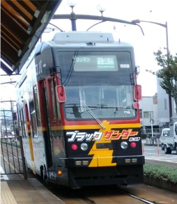

**～労供労組協秋の学習会２０１９～**

１１月８～９日愛知県豊橋市で開催された「労供労組協秋の学習会２０１９」に参加しました。労供事業を営む労組が各地から集まりました。

【請負とクラウドワーカーの働き方は問題だらけ】

連合総研の杉山豊治副所長をお迎えし、「雇用類似の働き方と労働組合」と題した講演がありました。２０１７年に行った請負就業者とクラウドワーカーを対象とした意識調査を基に解説され、その後フリーランスの労供事業の可能性について話し合いました。

講演する杉山豊治さん

杉山さんが紹介したアンケート調査で浮かび上がったのは労働者としての権利の低さです。賃金、休暇、スキルアップの機会の無さ、トラブルがあっても相談先がないなど問題は山積みです。気になるのは、労働組合についての設問で「加入してないし、加入したくない」が73.1％、同業者の団体またはネットワークについても「加入してないし、加入したくない」が63.4％と、団体への拒否感があったことです。多数の労働組合が大企業正社員しか相手にしてこなかったことも事実なので、期待されないのもわかります。しかし、IT業界にもフリーランスは見えにくい形でたくさんいるし、不当な待遇で働く人がいることは、私たちにとっても相対的な賃金低下や長時間労働の拡大につながります。労組への理解を促す努力とともに、労働法に守られない労働者をなくす法整備および企業への規制が必要です。

　【日々雇用で強まる職安の圧力】

運転手の労供組合から、「日々雇用で仕事が切れた際に一般の雇用保険へ切り替えるよう職安から執拗に指導される。長年、供給組合に加入していればよしとされていた。さらに組合を介さず直接個人に圧力をかけてくるなど、組合無視、組合員の分断化が強まっている。職安には日雇い保険をなくしたい意図がある」との報告がありました。

【労供の社会保険適用は日々雇用に使えるか】

横山書記長は社会保険適用について説明し、「組合で社会保険に入れれば日雇い保険でなくてもいいのでは」と提案しました。それに対し、生コン労組からは「複数の兄弟会社に在籍させて所得税、保険料を節約し、長時間労働をさせるブラック企業が流行っている。『供給期間中に限り雇用責任を負う』というやり方を知れば悪用する者が出てくる」、港湾労組からは「社会労働保険の代行を担うには事務経費がかかる。港は法的に無理」といった意見がありました。コンピュータ・ユニオンには３年の期間制限を超えて臨時一時的な雇用を維持したい特殊事情があり、他の業界にもそれぞれの慣習や法律があることを共有して、全体の取り組みにはしないことになりました。

【協議会の緩さで労供の共通項を探したい】

全体として、各団体の自主性を尊重し縛りのない協議会の良さが生きた学習会でした。業種や地域により違いはあるものの、労供組合は弾圧による組合員の減少など厳しい状況にあります。拡大も必要ですが、この協議会の交流と討議を深めて、労働組合による労働者供給事業を守っていきたいと思います。

ブラックサンダー仕様の豊鉄市内線

【お疲れさんぽ】

豊橋はきゅうりのキューちゃんやブラックサンダー、ごみゼロ運動の発祥の地と、なかなかユニークな地域。半日の散歩を楽しんで帰京しました。

■ コンピュータ・ユニオン ソフトウェアセクション機関紙 ACCSESS 2019年12月 No.386 より
