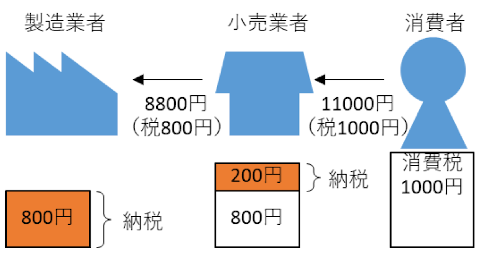

2019年の10月から、消費税が10％になりました。

軽減税率導入で新聞が8%やらおもちゃとセットになったお菓子は10%やら、店内で食べると10%だけど持ち帰れば8%だと話題になったかと思えば、ポイント還元でキャッシュレス促進だとか、話題に事欠かない消費税ですが、皆様いかがお過ごしでしょうか。  
そんな消費税は、国税庁のHPには「販売やサービスの提供などの取引に対して広く公平に課税される税」と説明されています。  
しかし、キャッシュレス決済でポイント還元とは言いますが、キャッシュレス決済を扱えない高齢者や小学生などが還元を受けられないという不公平さが指摘されています。そんな中、ひっそりと導入されるのが2021年度から段階的に導入されるインボイス制度で、主に個人事業主や零細企業が影響を大きく受ける制度です。

インボイス制度の説明をする前に、まず消費税の納税の仕組みについて図を使って再確認しましょう。  
消費者が1万円の商品を買った場合の消費税は1000円なので、小売業者に1000円の消費税を支払います。小売業者は受け取った1000円を納税しなければなりません。しかしその商品を8000円で仕入れた場合は800円の消費税を製造業者に支払っています。  
つまり、受け取った消費税1000円のうちの800円は既に支払い済みなので、差額の200円を納税します。この差額だけを納税する仕組みを転嫁と呼びます。  
消費税を転嫁するためには仕入れにかかった消費税の額を把握し、証明できる状態にしなければなりませんが、その時に必要になるのが領収書です。インボイス制度が始まると、領収書に適格請求書発行事業者登録番号が記載された領収書しか消費税の転嫁が出来なくなります。  
例えば仕事でタクシー移動をした時に受け取った領収書に、この登録番号が書かれていない場合、その領収書を会社に提出すると、タクシーに消費税を支払っているにもかかわらず、会社は消費税の転嫁が出来なくなってしまいます。当然会社は登録番号を記載したタクシー会社を使うように指示をするでしょうから、登録番号がなければ顧客を失ってしまいます。要は領収書に登録番号を記載すれば良いのですが、税務署に消費税を納税しなければ登録番号はもらえません。

しかし、制度としては売上高が1000万円以下の小規模な事業者と、開業２年以内の事業者はこの消費税の納税を免除されており、現在では免除された消費税は運転資金などに利用されています。  
一方では免除をしながらも、一方では納税しなければ仕事が立ち行かないように切り替えようとしています。  
これは個人事業主はもちろん、起業したばかりの会社を追い詰める制度です。  
これまで免除していた事業者からも消費税を取るということも目的の一つでしょうけれども、小規模な事業所を廃業させ、新たな起業を抑制することで、大企業を優遇するのも目的の一つなのではないでしょうか。

消費税は既に引き上げられ、軽減税率も始まってしまいましたが、引き続き反対の意思を示していかなければなりません。

■ コンピュータ・ユニオン ソフトウェアセクション機関紙 ACCSESS 2019年11月 No.385 より
