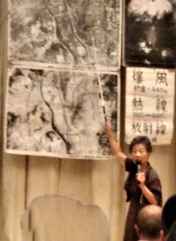

## MIC長崎フォーラム

台風８号の通過後、９号と１０号の接近が心配された８月８日～９日、長崎市で開かれた[ＭＩＣ](http://www.union-net.or.jp/mic/)長崎フォーラムに参加してきました。今年のプログラムは下記のとおりです。

１日め ①被爆者講演 ②基調報告 ③パネル討論 ④アピール文採択 ⑤交流会  
２日め 平和散歩または式典参加

【被爆者講演】

講演する八木道子さん

八木道子さんは、６歳のときに爆心地から３.３キロメートル地点の自宅で被爆しました。その後小学校教諭になり、退職後に被爆語り部として証言活動をされています。自作のパネルや写真を示しながら、先生らしくはっきりとした声でわかりやすく話してくださいました。

爆風、熱線、放射能といった原爆の恐ろしさを、数字をあげて、お風呂の温度や台風の風といった身近な例と比べて説明し、悲惨な様子も具体的で、誰にもその光景が思い浮かぶようなお話でした。

印象に残ったのは聴衆を引き込んでいく話の上手さ。こんな授業ならすべて頭に入ると思いました。この講話を聞くことができてほんとうによかったです。最後に「平和は歩いて来てはくれない。平和は作って守っていかなくてはいけない。」と話しておられました。

【基調報告とパネル討論】

「平和教育の“現在（いま）”～被爆地での歩みと模索～」と題して三人の報告と討論が行われました。

戦争と被爆の歴史を伝えるために続けられてきた平和教育が縮小されてくる中で、さまざまな工夫を重ねる教育現場の取り組みが紹介されました。わたし自身は平和教育と名乗った授業を受けたことがないですが、会場の半数が同様でした。広島、長崎、沖縄以外の地域で育った子どもは戦争どころか近代史もまともに学んでなく、そういった状況が、今の平和や世界情勢に無関心な風潮の要因ではないか、という意見がありました。

【交流会】

本場の卓袱（しっぽく）料理をいただきました。とても美味しかったです。自己紹介で電算労の紹介と、八木さんに講話の感想とお礼を言うことができました。私なりの世界の平和への向き合い方を話すと、笑顔で大きくうなずいてくださいました。八木さんは女性が選挙権を持つためにどれだけ頑張ってきたかと、歴史を変える力を持つことの重要性をお話しされました。長崎在住の参加者がオススメのお土産を教えてくれたり、互いの労組の課題を話しあったりと、にぎやかで楽しい交流会でした。

【翌日以降】

９日、午前は式典に参加し、午後から平和散歩のコースを歩きました。ところどころで知らないグループに紛れ込んでガイドさんの説明を聞いていてもウェルカムです。原爆資料館では、詩人アーサー・ビナードさんの紙芝居を見ました。丸木伊里、丸木俊さんの「原爆の図」を題材に６年かけて紙芝居を作成し、長崎初披露とのこと。ユーモアがあってとても面白かったです。

あと２日滞在し、隠れキリシタンや出島の歴史を学んだり、トルコライスやちゃんぽん、ミルクセーキを食べたりと充実した旅を過ごしました。みなさん送り出していただいてありがとうございました！

■ コンピュータ・ユニオン ソフトウェアセクション機関紙 ACCSESS 2019年9月 No.383 より
