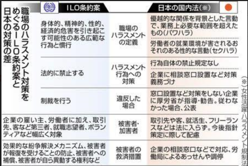

[MIC](http://www.union-net.or.jp/mic/)が実施しコンピュータ・ユニオンも集計に関わった『セクシャルハラスメント被害と職場の対応に関するWEBアンケート』の速報が6月7日に発表されました。続いて21日、国際労働機関（ＩＬＯ）総会はセクハラやパワハラなどのハラスメントを全面的に法律で禁止し、制裁を設けることなどを盛り込んだ条約を賛成多数で採択しました。日本政府と労働者代表として参加した連合は賛成、使用者側代表の経団連は棄権したとのこと。日本では5月に駆け込みで法改正していて、今後罰則付き国内法の整備が必要になる『批准』をするつもりはなさそうです。

**【 誰がハラスメントを受けるのか 】**

反対側が拘ったのは範囲。店員と客を含む取引先との間で発生するハラスメントの扱いは各国の裁量で合意したが、請負やフリーランス、研修生、求職者、ボランティアは対象に含まれました。アンケートでも「正社員へのセクハラが厳しくなってフリーランスへ『外注』されている」との声が。私が遭遇したケースでも客先正社員から契約社員へのパワハラでした。取引先との関係でハラスメントが認められないのであれば労供でも他人事ではありません。

**【 罰則なしでは効果なし
】**

MICアンケートでは「条約に賛成し批准するべき」が96.4%。「罰則付き『セクハラ禁止』国内法を作るべき」が87.4%でした。罰則を設けてはっきりと禁止せず今のような努力義務、理解を求めるレベルではハラスメントがなくならないことを皆実感しているのでしょう。

セクハラという言葉が知られるきっかけになった初の民事裁判から30年。いまだに何がセクハラか理解できなかったり言葉の定義に拘って理解を拒否していたり、相談窓口があってもまともに機能していないところが多い、こんな状況では法規制以外ありません。

東京新聞 6/22 より

**【 居心地の良い環境へ 】**

会社や組織の環境を良くするために少しでもできることはやっていきましょう。

まず自分が加害していないか振り返ってみることです。言動が誰かを傷つけてないか。年長者や先輩の立場にある自分が上から目線でマウントとっていないか。特に若い人や女性の話に割り込んで黙らせるようなことをしていないか。居酒屋で女性の尻をなでないか。心の中に差別意識はないか。承認欲求を他人に求めていないか。

そして傷ついた側は我慢して口をつぐむ必要があるのか考えてみてほしい。再発を防ぐためにも抗議はできないか。相談できるとしたら相手は誰か。

そして相談される相手になるために、組合として用意できることは何か。みんなで考えていきましょう。

■ コンピュータ・ユニオン ソフトウェアセクション機関紙 ACCSESS 2019年7月 No.381 より
