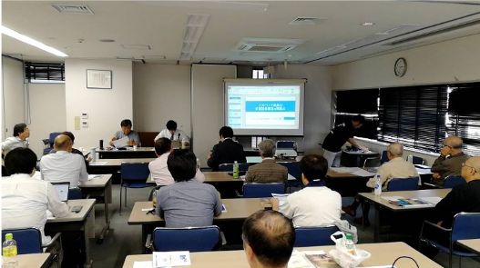

2019年5月11日14:30から、神田明神とサッカーミュージアムの近くの平和と労働会館8F民医連会議室で「SE労働の実態と過労死・メンタル不全を防ぐ学習会」が開催されました。学習会の主催は「働くもののいのちを健康を守る全国センター・SE労働と健康研究会」 ( <https://www.inoken.gr.jp/>
) で、参加者は30人です。

学習会ではまず、[ITユニオン](https://it-union.jp/)執行委員長の山中隆さんから、IT業界の多重請け負いの構造と制度の改善の方向について、実例も含めて報告していただきました。また、[首都圏青年ユニオン](https://www.seinen-u.org/)の宍戸則恵さんより、「Amazonからいいがかりのような理由で解雇された」、「金曜の夕方に月曜朝までの納品を求められるような短納期」などの実例を紹介していただきました。

次に、コンピューター・ユニオンの横山さんから情報サービス産業の健全化に向けた提言についての報告として、IT業界の状況、実例、提言の内容などについて報告していただきました。提言については研究会のページで、「SEブラックプロジェクトチェックリスト」 ( <https://www.inoken.gr.jp/study-group/147.html> )と併せてご参照ください。

そのあと、4～5人のグループに別れて、「SEブラックプロジェクトチェックリスト」の内容について議論しました。[電算労](http://www.union-net.or.jp/densanro/)から多数参加していたので、現場を知っているメンバーとして各グループに入っています。各グループの議論の結果を発表する時間がなかったため、他のグループの様子はよくわからないのですが、私とMさんが入ったグループではそれぞれの職場の様子や、実際に起きた問題、そしてどんな風に体調をくずしたかなど具体的にお話ができました。

[SEブラックプロジェクトチェックリスト](https://www.inoken.gr.jp/study-group/147.html)

1. 多重派遣や偽装請負など、違法な雇用形態が蔓延している。
2. 十分な予算、開発期間が確保されていない。
3. システム開発に必要な能力が備わった人員が配置されていない。
4. 発注者や元請けの無理な要求が多い（仕様が決まらない。無理なスケジュールや頻繁な仕様変更等）。
5. プロジェクトマネージャー（PM）等の管理者がプロジェクトを管理できていない。
6. チーム内や元請け・発注者との関係やコミュニケーションが良好ではない。
7. ハラスメント、責任転嫁など、チーム内のモラルが崩壊している。
8. 終電帰り・徹夜・休日出勤等の長時間労働が当たり前になっている。
9. 残業代が出ないなど、プロジェクトメンバーに正当な対価が支払われていない。
10. 体調不良を訴えるメンバーが多く、うつ病などの精神疾患や過労死が出ている。

■ コンピュータ・ユニオン ソフトウェアセクション機関紙 ACCSESS 2019年6月 No.380 より
