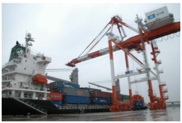

派遣や請負、契約社員など正社員でないいろいろな働き方が増え続け、いまや四割が非正規雇用です。そんな中、労働組合による労供で働く人はどんな仕事をしているのでしょう。私たちも入っている労供労組協に加盟している組合を紹介します。

最初にご紹介するのは全港湾。港湾荷役関連の個人加盟組合で約２万人超。北海道から沖縄まで支部があり、大型貨物車の運転士、作業員など２２職種で月平均８５０人が労供で働いています。なかでも貨物船からコンテナを陸揚げするガントリークレーンの操縦は「労供の息のかかってないヤツはいない」と委員長が豪語するほど。ガチでガテンな男の職場という感じです。

ガントリークレーン 先端の小部屋が操縦席

ガチと言えば連帯労働組合関西地区生コン支部。日々雇用の労働者の権利を守るために日雇い手帳をめぐりハローワークとも戦っています。ネットではデマ攻撃ばかりされていますが、弱い立場に置かれた人に寄り添った活動をしています。

表紙の猫がかわいい関生の書籍

私たちの事務所があるタブレット根岸の５階に事務所を構える労供労連。タクシー、ダンプカーや観光バス、選挙の宣伝カーの運転手もやってます。派遣では禁止されている交通誘導警備員も。東京都のゴミ収集車の運転と作業員の多くは労供だそうです。

ガテン系でないところでは介護家政職ユニオンの介護士やヘルパーさん。中にはや個人のお宅と何十年も契約しているベテラン家政婦さんもいます。

日本音楽家ユニオンでは結婚式やイベントでの演奏、レコーディングスタジオのミュージシャンなどが労供で働いています。著作権やオンラインでの音楽の対価支払など音楽家の権利の問題で国際組織と連帯して活躍しています。

全国には１００を超える労供事業所があり、労供労組協に加盟しているのはその半分。非正規のまま長年継続を繰り返してきた学校給食の調理員や用務員など公務労働の分野や、地方の工場で仕事が減らされている外国人労働者を支援する組合が、これから労供でやっていこうと模索しています。

ふだん町なかで見かける働く人々はもしかしたら労供かもしれません。スーパーで買う輸入食品を船から降ろす人、トラックで運ぶ人、買物中にふと耳にする音楽を演奏する人も、ゴミを集めて片づけてくれる人も、いたるところに労供の仲間がいると思うと、ちょっとうれしくなりませんか？

---

労供労組協（労働者供給事業関連労働組合協議会）

１９８４年２月に１４組合１００名で結成し、現在は１９組合、組合員総数約８５万人。うち労供事業就労は約６，０００人。労働者派遣法が成立する過程で、職安局長の私的諮問機関から「派遣法制定と労働組合による労働者供給事業の廃止」が提言され、これに危機感を感じて結成された。

---

■ コンピュータ・ユニオン ソフトウェアセクション機関紙 ACCSESS 2020年12月 No.398 より
