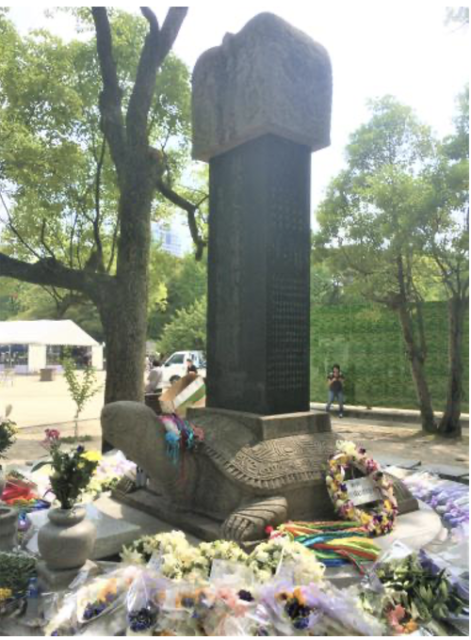
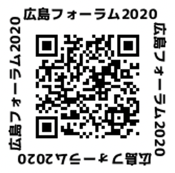

### 韓国人被爆者支援から日韓交流、そして核なき世界へ

今年のMIC広島フォーラム、長崎フォーラムはオンラインで行われました。現地に赴いて多くの人々と直接話すことができず寂しい思いもありながら、８月６日に行われた広島フォーラム、９日の長崎フォーラムの動画を視聴しました。

#### 【広島フォーラム】

豊永恵三郎氏さん（韓国の原爆被害者を救援する市民の会・広島支部）のインタビューとパネルディスカッションが行われました。

９歳で入市被爆（原爆投下後に市街地に入って残留放射能に被爆）した豊永さんは高校教師をしていたときに在日韓国朝鮮人差別を知り、それ以来、在日コリアンに寄り添ってきました。71年にソウルを訪ね、初めて海外で暮らす被爆者と出会います。

「放射線の影響があって満足に働けず、すさまじい窮乏生活でした。韓国の政府からも日本の政府からもまったく援助が無かったからです。しかも、当時の韓国は軍人の政権で平和運動なんかできませんでした。」

72年に「韓国原爆被害者を救援する市民の会」広島支部を作り、在韓被爆者の被爆者健康手帳取得などの支援を始めます。1980年に始まった政府間の渡日治療事業（韓国の被爆者を日本に招いて治療する事業）がたった６年で終わった後も2014年まで民間で続けました。 「日本は明治以降植民地支配をして、たくさんの人が日本に来ましたよね。広島は「軍都廣島」ですから、韓国で生活できなかった人が仕方なしに来ました。それから日本が戦争に負け始めて、強制連行をして軍需工場で働かせた。そして被爆した。その人たちを日本の国、政府は放置したわけでしょう。日本には戦争に対する加害責任があるのだから、きちっとした補償をすべきだと思ったんだけど、日本政府が補償をしないので市民運動で少しでもできることをやっていこうとしたのです。」

朝鮮半島出身者以外にも台湾、東南アジア、アメリカ、ブラジルにも被爆者はいて、留学生や捕虜も被爆しました。そうした「在外被爆者」の総数はわかっていません。被爆者総数の約１割はいるのではないかと言われています。

資料「在外被爆者裁判一覧表」によると74年から今に至るまで43件もの裁判が闘われました。

「在外被爆者は多くの裁判で勝って、多少とも援護ができるようになりました。でもまだ補償ができてない朝鮮民主主義人民共和国の被爆者が一番困ってると思う。」

昨年、広島と大邱市の市民グループが「核兵器廃絶と平和な世界の実現をめざす大邱と広島の会」を結成しました。 　「核兵器をなくす、戦争をなくすということを、日本と韓国の若い人たちにも理解してほしい。そのために交流を続けたい」と語りました。

#### 【長崎フォーラム】

「被爆75年 創作で語り継ぐ原爆」と題して、原爆の絵を描き続ける画家の尾崎正義さんと映画監督の松村克弥さんにインタビューしました。松村監督の戦後の長崎を舞台にした新作「祈り～幻に長崎を想う刻～」は来年夏に公開予定です。

#### 【平和アピール】

核兵器のない平和な世界を構築するために、国境を越えた市民の連帯をと呼びかける「広島アピール2020」を採択しました。

<https://youtu.be/3ysHRZ8mrxA>

■ コンピュータ・ユニオン ソフトウェアセクション機関紙 ACCSESS 2020年9月 No.395 より
