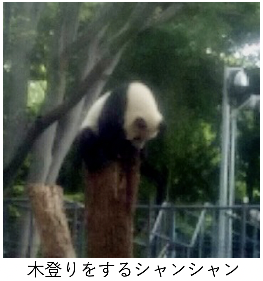
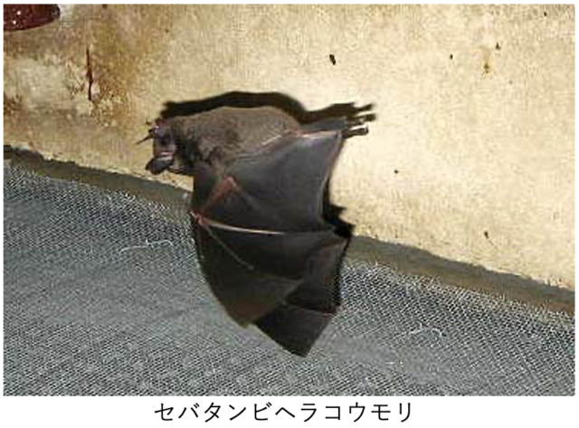

梅雨も中休みの曇り空の土曜日6月16日、文化部主催の上野公園&串揚げツアーが行われました。

上野動物園ではお昼から各自で自由参加、思い思いに園内を回っていましたが…

今の話題はなんといっても1歳を迎えたパンダのシャンシャン! ところが、長蛇の列で、見るには150分待ち! ということで、ほとんどの方がパンダは見てなかったそうですが、それぞれに色んな動物を見て土曜の午後を楽しみました。

他の参加者からはこんな感想が寄せられました。

---

上野動物園といえばパンダが代名詞ですがもちろん他の動物もいます。ペンギンもいればキリンもゾウもいますよ。 しかし今回上野動物園に行って一番興味を惹かれたのはコウモリです。

セバタンビヘラコウモリ。ぶら下がっているときは体長5cmくらいで羽を広げると20cmくらいでしょうか、コウモリと聞いて我々が想像するコウモリに近いサイズじゃないかと思いますが、もうひっきりなしに飛んではぶら下がり、飛んではぶら下がりして面白いです。

飛んでいる軌道から木の枝に足を引っ掛けて急にぶら下がるので、どこにぶら下がるのか読めません。

小獣館や夜の森という建屋があって、夜の時間帯に照明で明るくし、昼の時間帯に暗くすることで夜行性の動物を見られるようにされていました。

ミナミコアリクイもいて、ぜひ威嚇のポーズをしてほしかったのですが、誰もちょっかいを出さないせいかノビノビとしていました。

他の動物の話ばかりしていますが、これはパンダの行列が 150分待ちだと聞いて挫けたわけでは無いのです。

---

そして夕方は交流会場：「串揚げ じゅらく 上野店」に総勢11名で集まり串揚げと共に日頃会えない仲間との貴重なひとときを楽しんで盛り上がってきました。

主催してくださった文化部の皆さん、お集まりいただいた皆さん、おつかれ様でした＆ありがとうございました。

■ コンピュータ・ユニオン ソフトウェアセクション機関紙 ACCSESS 2018年7月 No.369 より
