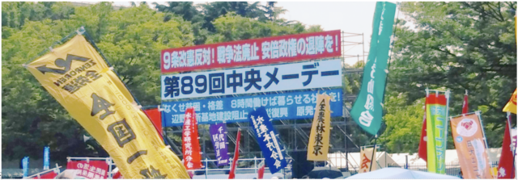
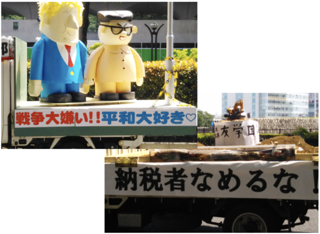

「第1の8時間は仕事のために、第2の8時間は休息のために、そして残りの8時間は私たちの好きなことのために」……メーデーの起源とされる1886年のアメリカの統一ストライキでは、これが目標として掲げられたそうです。それから1世紀以上経ちましたが、私たちはまだ残業しています。

今年のメーデーは快晴で、歩いていると暑いくらいでした。代々木公園の会場に入る手前には東京土建一般労働組合の各支部のトラックが並んでいて、それぞれ大きなデコレーションを載せています。

私たち電算労はMIC（マスコミ文化情報労組会議）の加盟組織等とともに代々木公園の中央メーデーの集会と新宿までのパレードに参加し、その後、親睦会をしました。明治通りでは私たちの写真を撮る人も目につきました。

5月1日のメーデーは全国では307カ所で開催されたそうです。都内では、この代々木公園の他、多摩地区（会場立川）、全労協などが主催する日比谷野音が主な会場になります。連合は参加者を集めやすい4月28日に代々木公園で実施していたのですが、いろいろあって政党の代表を呼ぶことができず、会場の真ん中の舞台ではそのいろいろなことの主役の都知事が目立っていたようです。

戦前の日本では二・二六事件で戒厳令が敷かれた後の10年間、メーデーが禁止されました。来年は天皇の即位日とぶつかりますが、平和と民主主義を守ってまた同じところでお会いしましょう。

■ コンピュータ・ユニオン ソフトウェアセクション機関紙 ACCSESS 2018年6月 No.368 より
