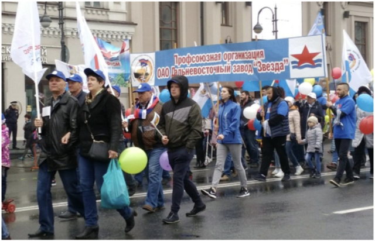

GWに4拍5日でウラジオストクに行ってきました。

成田から2時間半で行ける「一番近いヨーロッパ」。美しい街並みの港町で、労働者の祭典メーデーを見てきました。

ロシアのメーデーは春の訪れを祝う「春と労働の日」。町中が花や風船で飾り付けられ、屋台が美味しそうな香りを振りまき、広場や街角で演奏会が行わる祝日です。朝から延々続くパレードは個性豊かな衣装やダンマクで華やか。5車線のメインストリートいっぱいに広がって行進できるなんてうらやましい…。

実はロシアを訪れるのは初めてなのに観光地ではないから情報が少なすぎ。航空券とホテル、ビザとWi-Fを用意しただけのノープランで出発しました。

結果、知らないことにたくさん気づくことができて楽しい旅でした。書ききれないので箇条書きで。

- フルーツジュースが種類豊富でめちゃくちゃ美味しい。
- メイド喫茶風レストランはハイソな大人に大人気。もふもふキュートなグッズ増殖中。
- メニューの飲物はS, M, Lでなくミリリットルできっちり表記。
- 8時過ぎまで日が暮れず深夜でも大勢が出歩いてる。
- 横断歩道でなくても歩行者がいたら車が必ず止まる（慣れてないから気まずい…）
- 話しかけづらい（実はシャイなだけ。めっちゃ親切）
- 中央アジアの大平原に憧れている（らしい）。
- 基本、傘はささない。英語は通じない。
- マックやスタバといった西側っぽい店はまったくない。
- 「フレッシュ25」という24時間スーパーのお惣菜は絶品。
- 市場で新鮮な魚を買って備付けのレンジでチンしてベンチで食べるの美味しい。
- ゲーセンはないけど映画館にレトロなコインゲーム機があって親子の攻防戦が繰り広げられる。
- 輸入マンガ専門店に日本のものは置いてない。同人誌含めすべてにR表記があり最低でもR12。大人の知的嗜好品でSFが人気(日本のマンガはお呼びでない感じ)。
- ウラジオストク空港から平壌行きは北朝鮮のビジネスマン満載200人超えの大型機。成田行きは70人乗りの揺れるプロペラ機（…やはりここは東側）

まだまだあるけどこの辺でおしまい。ロシア初心者にウラジオストクおすすめです。

■ ピュータ・ユニオン ソフトウェアセクション機関紙 ACCSESS 2018年6月 No.368 より
