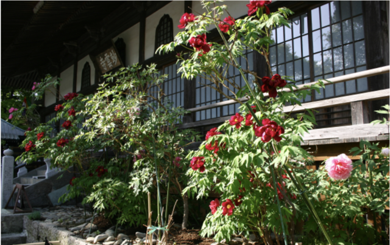

5月中旬、栃木県那須に行ってきました。

目的はお墓まいりなのですが、妙雲寺では、いろんな色の牡丹が咲いていました。

牡丹と少し時期がずれて芍薬も咲くようです。

春先は、八幡のツツジに、ゴヨウツツジ、と色々な花が楽しめて、塩原から那須辺りはハイキングに丁度よいころです。後は、宿でゆっくり温泉に入って、目と身体を癒すことができました。

翌日、藤城清治さんの美術館に行ってきました。

昔、ケロヨンの人形劇、コビトさんの出てくる影絵を覚えていませんか？

その作者です。

時間があっという間に過ぎる位楽しめる美術館でした。懐かしさとともに作品の素晴らしさに是非おススメしたいです。

■ コンピュータ・ユニオン ソフトウェアセクション機関紙 ACCSESS 2018年6月 No.368 より
