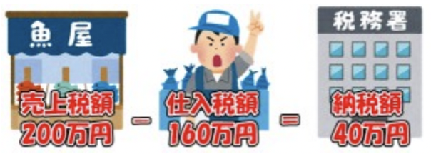

皆さん、インボイス制度をご存知でしょうか？

主に関係するのは事業主です。そのため社会保険が適用されている雇用労働者の方は基本的には意識する必要はありませんので、よく知らない方が多いのではないでしょうか。

インボイス制度とは、正しくは適格請求書等保存方式と言います。  
消費税に関わる制度で、取引における消費税の額を正確に把握し、不正やミスを防ぐことを目的にしています。現在の消費税は10%ですが、税率が8%になる軽減税率も混在しているため、取引内容や税率ごとの消費税額、適格請求書発行事業者の登録番号等、インボイスの記載内容を満たした請求書を発行・保存しましょうという制度です。

インボイス制度は2023年10月1日から始まります。それに先駆けて、2021年10月1日から登録申請書の受付が開始され、2023年の3月31日までに登録申請をしておく必要があります。申請すると、税務署から登録番号が通知されるので、請求書に登録番号を記載することで、適格請求書として扱うことができるようになります。

事業主は、受け取った消費税額から、自分が仕払った消費税額を差し引いた金額を税務署に納税します。これを仕入税額控除といいます。

しかし、適格請求書を発行できない事業者からの仕入れは、仕入税額控除を受けられなくなります。  
適格請求書発行事業者にならないと、取引先に消費税の納税額分の負担を押し付けてしまうことになります。

図の例では、仲買人が的確請求書発行事業者では無い場合、魚屋が仕入れ税額控除を受けられないため、この仲買人ではなく、別の仲買人から魚を仕入れることにしてしまう恐れがあります。それを避けるために仲買人は適格請求書発行事業者の申請を行います。

ここで問題になってくるのがフリーランスや個人事業主として仕事をしている人です。  
年間の売上が1000万円以下の事業者は消費税の納税義務がありません。このような小さな事業者に対しては消費税納税に関わる煩雑な負担を軽減する等の目的で消費税の納税が免除されています。  
しかしインボイス制度の導入に伴って、適格請求書発行事業者になるには、消費税の課税事業者にならなければならず、その消費税納税に関わる煩雑な負担を負わなければならない上、これまで免除されていた消費税を納税する必要があります。これはフリーランスで働く人たちにとっては非常に大きな影響です。

また、新しく起業する場合も2年間は、同じように消費税が免除されていましたが、納税しなければ同様に適格請求書発行事業者になれず、起業後のスタートダッシュがこれまでよりも難しくなります。  
ベンチャー企業等を起業するハードルが上がるため、新しいサービス等が生まれにくくなり、将来的に産業が先細っていく危険性もあるのではないでしょうか。

■ コンピュータ・ユニオン ソフトウェアセクション機関紙 ACCSESS 2021年10月 No.408 より
