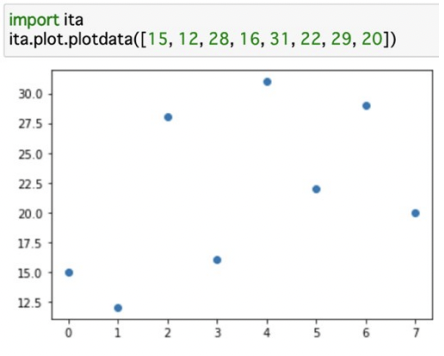

東大は国立大学の中で学生数が一番多く、理系は1学年約1,800人です。そこで全員に使わせるテキストは普通に売っても商業的に成り立ちます。そんなテキストの一つ「Pythonによるプログラミング入門 – アルゴリズムと情報科学の基礎を学ぶ」を途中までやってみました。

前提知識の要求は低くて、高校2年程度、文系進学コースでも数学を捨てないパターンならやってるはず、の数学でなんとかなります。必要な公式などは書いてくれているので忘れていてもだいじょうぶ。  
すでに何らかのプログラム言語をやっている私たちには、プログラムから逆に何をやりたかったのかわかるものも多いです。例えばΣ記号はずいぶん久しぶりに見ましたけれど、要するに1からnまでループすればいいです。そんなことなら仕事で毎日やってます。

で、最初の足し算・引き算・掛け算・割り算から順に例題と練習問題をやってみたのですが、

先生！練習問題2.4. は式がまちがってます！

理系の学生さんは自分で正解を見つけてなんとかしてください。ITの職場なら元が間違っているようなことは日常茶飯事ですから。

私たちの普段の仕事と違って面白いのは、グラフなどを描くことができるライブラリです。単純なものなら1行で書くことができます。放物運動のシミュレーションとして、放物線アニメーションを表示する例題もあります。必要なもの一式をインストールする手はこちらにまとめました。  
<https://pages.michinobu.jp/t/installanaconda.html>

後半の章には p値、モンテカルロ法、回帰分析、クラスタリングなど、AIや機械学習でも使うことになりそうなものが出ています。プログラムの行数は意外に少ないです。コーディングができだけではその方面の仕事にはならないでしょうから、続きをやってみようと思います。

それから、最近、ハーバード大学の教材も日本語化されています <https://cs50.jp/> 。そちらはSQLやHTMLなどを含む実用的なものです。

■ コンピュータ・ユニオン ソフトウェアセクション機関紙 ACCSESS 2021年7月 No.405 より
