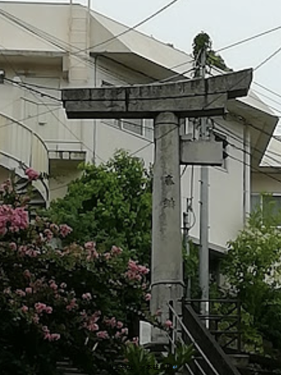
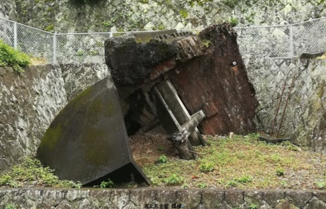

8月8日から9日にかけて、MIC（[日本マスコミ文化情報労組会議](https://www.union-net.or.jp/mic/)）長崎フォーラムに参加してきました。

山王神社　一本柱鳥居

皆さんご存知だとは思いますが、日本には原爆が2発落とされていますが、「長崎は広島よりも低く見られていないか」と講師の高瀬毅氏は語ります。その理由の一つに、被爆のシンボルとなるものが無い事をあげています。広島には原爆ドームがありますが、長崎にはそれに相当するシンボルが無いのです。  
街の中には、爆風で半分が吹き飛ばされて半分だけが残った山王神社の一本柱鳥居や、被爆して枝葉が落ち、幹を焦がしながらもその後息を吹き返した被爆クスなどがあります。しかしシンボルにはなりきれません。

実は終戦直後にはそのシンボルとも言える浦上天主堂という建物が残っていました。しかし戦後13年目、保存の声が高まっていたにも関わらず、取り壊されてしまいました。当時の市長を含めて市議会では保存の方向で固まっていたのですが、あるとき市長が姉妹都市の提携をするためにアメリカへ渡ります。そしてアメリカから戻った市長の意見が取り壊しへと一転してそのまま取り壊されてしまい、今では浦上天主堂から崩れ落ちた鐘楼と平和公園に移設された壁の一部が残るのみです。

戦争が終わったのは1945年8月15日。それから72年が経ちました。当時のことを知る人は年々少なくなり、それを語り継ぐ人も少なくなっていきますが、それを止めることはできません。それでも、今では戦後生まれの人を語りべとして育てる活動も始まっています。地元の高校生がVRを使って原爆の被害を伝える活動も行われており、次の世代へ語り継ぐ活動はこれからも続いていきます。

広島は世界で初めての被爆地です。それに対し、長崎は世界で最後の被爆地ではありません。

世の中に原爆が存在している以上、次の被爆地が生まれる可能性があります。

おりしも北朝鮮とアメリカの間に不穏な空気が流れ始めており、どちらも好戦的なので歯止めが効かず、きな臭い雰囲気が漂っています。

浦上天主堂 鐘楼

そんな中7月7日に核兵器禁止条約が賛成122、反対1、保留1の圧倒的多数で採択されました。

世界では、すでに核兵器禁止という考え方が多数派になっていることは明らかです。

日本はこれまで、核兵器に反対をしており、非核三原則という言葉まで生まれて長年に渡って使われて来ました。それなのに、その場に日本がいないのはなぜなのでしょうか。

長崎や広島で、原爆で亡くなっていった人たちに対して、これをどのように説明すれば良いのかがわかりません。

■ コンピュータ・ユニオン ソフトウェアセクション機関紙 ACCSESS 2017年9月 No.359 より
