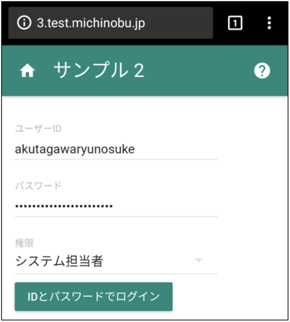

JavaScript ができたのは1995年で、ちょうど私がコンピュータの仕事に就いた頃のことです。その年のうちに JavaScript のサーバ・サイドの実装も出ていました。私がモバイル端末の仕事をしていた2000年頃にはそこそこ普及していて、同僚が「普通にオブジェクト指向だ」と評していたのを覚えています。

その後 Gmail や Google Maps に使われた Ajax によって JavaScript の用途が広がり、サーバ・サイドの実装も Node.js という名前で再び登場します。その Node.js は、取り扱いが容易でリソースを無駄にしない、システム基盤担当にはとてもうれしい仕様です。CPUやメモリを切り売りするクラウド業者も勧めています。これは是非とも勉強しておかなければと私は思ったわけです。

そうは言っても私は JavaScript の少々くせのある文法はあまり好きではなくて、サーバ・サイドとクライアント・サイドで同じ言語を使えることに魅力は感じていませんでした。ところが、私が Web系開発から離れている間に ES2015 という新しい規格ができていて、 Java や Python のようなきれいなコードも書けるようになっています。そこで、まず、 REST と呼ばれる形式の HTTPサービスを書いてみました。リソースを節約するための独特の書き方は、まだ少し敷居が高いかもしれません。

Reactで作成したUI

次に Facebook が作ったユーザ・インターフェースのライブラリ Reactを使って少し書いてみました。見た目は Material design という Google のユーザ・インターフェースのガイドラインに沿った形にしました。データと見た目の分離のために Redux というライブラリを追加しています。

React を使うと Webページだけではなく、Android、iOS、Windows 10 などのアプリもできるそうです。 Facebook のスマホのページとアプリがそっくりなのは、なるほどこれだったかと感心した次第です  
同様のフレームワークとして Google が作った Angular があって、日本以外では React よりシェアが高いそうです。

■ コンピュータ・ユニオン ソフトウェアセクション機関紙 ACCSESS 2017年8月 No.358 より
