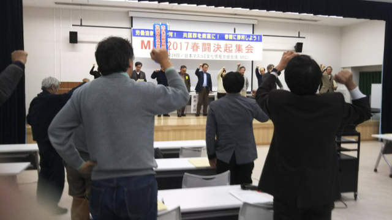

2月24日(金)文京区民センターでMIC（マスコミ文化情報労組会議）の2017年春闘決起集会がありました。参加者は130人で、基調講演は岩波新書「過労自殺」の著者、川人博弁護士の「長時間労働を無くすための労働組合への提言」です。一昨年自殺者を出した電通についてのことを中心にお話ししていただきました。

MICの加盟組織は、映演共闘、全印総連、新聞労連、広告労協、民放労連、音楽ユニオン、出版労連、電算労、映演労連です。長時間で不規則な働き方をする業種が集まっています。その中の広告労協に電通の労働組合も加盟しています。

私は、ソフトウェアの仕事に就く前に広告・印刷関連の仕事を少しだけやっていて、広告労協の組合がある会社の人とも仕事や活動でお会いしたことがあります。外回りの営業で靴を履き潰したというようなお話もお聞きしました。広告は、情報や印刷よりも景気の影響が大きい不安定な業種です。

打ち合わせで電通の人と同席したこともあります。聞いたこともない会社（イベント企画は実質私と上司の二人だけ）がその地方で一番大きな展示会場の設備のことを知っているので不思議そうにされていたのを覚えています。そのときの品の良い装いの紳士達のいたところがあんな会社だったとは想像はできませんでした。とはいえ、寝る暇もないような仕事は私もやってましたけど。

亡くなられた高橋まつりさんがいたのは、電通の中でもうまく行っていないとされているネット広告の部門です。その部門は、架空請求の不祥事も起こしています。ネット広告では、表示、クリック、コンバージョンなどの実績をベースに請求することが多いです。ですから架空請求のニュースを見たときには「人間がソロバン弾いてたわけじゃないよな？」と驚いたものです。電通などの既存の広告代理店の仕事のやり方とは合わないのでしょう。

時代に合わないだけでなく、人間に合わない仕事はやめましょう。たとえ仕事の好きな本人がそれでよいと思っていても、職場や私生活で周りの人にしわ寄せが及んでいるかもしれないと、川人博弁護士も言われていました。

■ コンピュータ・ユニオン ソフトウェアセクション機関紙 ACCSESS 2017年3月 No.353より
