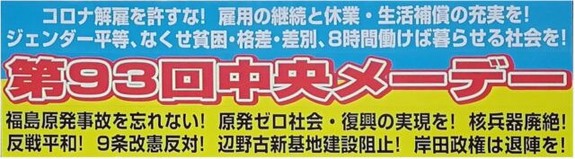

5月1日といえばメーデーですが、2022年は人数を制限する形で行われました。

コロナが蔓延してきた2020年、2021年はオンラインでの参加のみになっていたので現地に集合するのは3年ぶりということになります。しかし、やはり大規模な感染を防ぐため、例年の1/5程度の参加人数に押さえての開催となり、電算労からも人数を抑えて役員の参加のみに留めました。

会場はいつも通りの代々木公園ですが、いつもの広い会場の隣の会場を使いました。感染症対策として、出入り口で体温チェックとアルコール消毒が行われ、会場での食事と飲酒は禁止となっており、アルコールを含まないお茶等のみが許されていました。

会場ではいくつかの団体からのスピーチがありました。ジェンダー平等や8時間働けば暮らせる社会などの要求もありましたが、やはり一番はロシアのウクライナ侵攻です。憲法9条をはじめとしていろんな観点がある話題ですが、やはり人が人間らしい暮らしをするための最初の一歩目として、やはりまず平和に暮らせる社会がなければなりません。遠くの地域で起きていることなので現実感はなかなかないですし、私達にできることは多くはありませんが、平和を願うばかりです。

さて、今回は身近な団体として出版労連からのスピーチがありました。

出版労連は、電算労も加盟している[MIC(日本マスコミ文化情報労組会議)](http://www.union-net.or.jp/mic/)の加盟組織です。今回はその出版労連の中でもフリーランスが集まる出版ネッツからのスピーチがあり、今後導入されるインボイス制度に対する反対等のアピールがありました。

スピーチが終わるとデモ行進に移ります。

今年は表参道駅方面に進むルートのみですが、ちょうどそのころから小雨が降り始め、徐々に強くなっていきます。しかし、なんだか全然デモ行進が始まらず、どうしたのかなと思っているとしばらくして案内が入り、どうやらルートの途中に街宣車がいて、邪魔をしているとのことでした。

会場では姿どころか声も聞こえなかったのでかなり離れた場所で起きていたのかとおもいます。

そこでどのようなやりとりがあったのかはわからないので軽率なことはいえませんが、どんな人がどんな主張をするのも自由ですから、意見を発信することは結構なことだとおもいますが、他の人が主張しようとするのを邪魔するのは遠慮してもらいたいですね。

さて、徐々に新型コロナの感染者数も減っていますので、来年こそは人数を抑えての開催ではなく、みんなが会場に集まることができれば良いですね。

■ コンピュータ・ユニオン ソフトウェアセクション機関紙 ACCSESS 2022年6月 No.416 より
