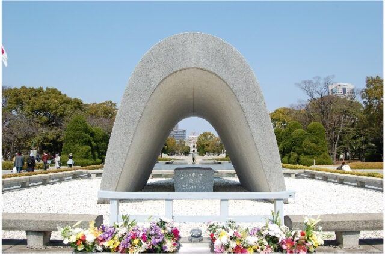

広島に原爆が投下された8月6日の前日にあたる、8月5日にMICの広島フォーラムが行われました。  
新型コロナが流行する前は現地に移動して参加していましたが、オンラインでの会議が一般的になった今では、Zoomを利用したWeb配信も同時に行われるようになったため、以前と比べると比較的参加しやすくなりました。  
今年はTBSテレビの久保田さんの講演とパネル討論の2部構成となっており、パネル討論は前述の久保田さん、被爆体験伝承者の笠岡さん、中国新聞の新山さんの3名によるものでした。

今年のテーマは「被爆者なき時代の核廃絶へのメッセージ」です。  
年月が経つにつれ、当時を知る人が減ってしまう中、どのようにして今後に語り継いで行くかは、以前から上がっている課題の一つです。絵に描いて当時の記憶を残す活動は以前から行われている活動の一つですが、近年では地元の学生などの協力を得て当時の風景を再現したVR映像を作るなどの取り組みも行われています。その中で長年継続的に続けられているものの一つに語り部があります。戦争当時を生きた方が見て聞いて体験したことを、直接その口で語ってもらえる活動であり、パネル討論にご参加された被爆体験伝承者の笠岡さんも語り部の１人です。  
講演していただいた久保田さんは、笠岡さんをはじめとする語り部の活動をしている方々にインタビューをし、それを伝える活動をしていますが、時代が変わったことによって話をスムーズに伝えることが難しくなっているということを強く実感しているとのことでした。当時の状況を説明する中で、大八車を使っていた話をすると、大八車を知らない世代から「大八車ってなんですか？」と聞かれるため、本題ではない大八車の説明に時間を割かなければならないことが多くなっていたり、「原爆が落ちたのがたまたま公園でよかったね」という発言をされることがあったりして、そうではなく後に公園にしたのだと訂正をする必要があるなど、当時を知らないことによって起こるギャップを埋めながら伝えていかなければならないことの難しさがあるといいます。この難しさを今起きている新型コロナウィルスに置き換えながら説明され、5年10年後であれば、共通の体験として「あのときのコロナは大変だったねぇ」で通じるとおもいますが、その後はそれも徐々に難しくなっていき、背景を説明しながらでないと説明が難しくなるだろうと説明します。この変化は、約10年前におきた東日本大震災と、約30年前に起きた阪神淡路大震災を例に取ってみても想像がし易いのではないでしょうか。そんなもどかしさを感じながらも、次の世代に伝えていくことで、今ある平和の大切さを改めて認識し、戦争をしてはいけないということを伝えていく重要性はこれからも変わらないのだと感じました。

終戦からもう 77 年経過しますが、戦争をしたくない、戦争をなくしたいという思いは共通しているのではないかと思います。戦争はひとりひとりがするものではなく国と国との争いではありますが、原爆の日や終戦の日など、年に一度のこのような日に、戦争をしてはならないと改めて認識し、過去にどのようなことがあったかを再び振り返ってみましょう。ひとりひとりがその思いを持つことで、将来の戦争を未然に防ぐことに繋がるのではないでしょうか。

■ コンピュータ・ユニオン ソフトウェアセクション機関紙 ACCSESS 2022年9月 No.419 より
