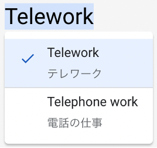

同窓生が一人カナダにいます。翻訳業と、それから、最近はリモートで英語の講師をやっています。Facebookに私がテレワークの話を書いていたのをその人が見て「テレワークって、電話で仕事をするの？」と。その人のパートナーもそんな用語は知らなかったそうです。ちなみにパートナーさんは生まれたときからカナダ、先祖はインディアンでカナダという国ができる前からそこにいたという人です。

ロンドンで仕事をしている別の同窓生にも通じませんでした。

Google翻訳さんも

ということで電話で仕事をするのかもしれないと思っているようですし、さらに、Longmanなどの辞書にも載っていなくて、「テレワーク」は英語圏では通じないようです。 英単語そのものはあっても、日本人が使っている意味で通じるかどうか微妙なものもあります。例えば「デグレード」はソフトウェアの開発プロセスやテストについての英語の文献では見たことがありません。英語の文献では同じ意味で “regression” を使うのが普通だろうと思います。

「普通」と言っても日常使われる言葉ではないですから、ソフトウェア開発や業務監査などの仕事をしていない人には理解できないです。昔、海外の会社の人との英語での会議の後、通訳さんに「“regression” ってどう訳したらいいんですか？」と聞かれて「デグレード」と答えて意味わからんという顔をされたことがありました。

カタカナ英語で困ったこともあります。韓国の人とお互いあやしい英語で話していたときのこと、「ラウター」というのが日本人全員わかりません。相手はなんでわからないのかわからないという様子です。

日本人： スペル？  
韓国人： R - O - U - T - E - R  
日本人： あ、、、ルーターだ

後で調べてみると /ˈraʊt̮ər/ は米国、 /ˈruːtər/ は英国で使われる発音だそうです。英語で仕事をしている人でしたらどちらの発音でもわかるんでしょうね。

■ コンピュータ・ユニオン ソフトウェアセクション機関紙 ACCSESS 2022年10月 No.420 より
