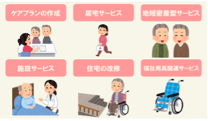

育児・介護休業制度が2022年4月1日、10月1日、2023年4月1日に改正されます。  
そこで、育児・介護休業制度とは何ぞやということで、少し勉強いたしましたのでご報告させていただきます。年齢的な興味心から介護休業制度を主に報告させていただきます。

育児・休業制度とは、育児や介護をする人が離職することなく仕事と家庭を両立できるようにサポートする法律のことです。育児休業制度とは、1歳未満（最大2歳）の子供を持つ従業員の養育を目的とした制度です。  
2022年10月から産後パパの育休の制度が創設されます。産後八週間のうち、4週間の休業が可能となります。

介護休業制度とは、簡単に言えば、自分の家族に介護が必要になったときに、受給条件さえ満たせば、仕事と介護を両立できるようにするために受けられる申請制の公的な福祉サービス・資格を定めた法律のことです。  
具体的には、以下の通りです。  
対象範囲は、負傷、疾病なで身体上、精神上の障害により、要介護の状態にある配偶者、父母、子、配偶者の父母、祖父母、兄弟姉妹、孫（同居の有無にかかわらず）です。  
2022年4月には、有期雇用労働者の受給対象範囲が緩和されました。  
要件としては、介護休業開始予定から93日が経過した時点で、以降6ヵ月の間に契約が満了することが明らかでないことです。

以下の資格が与えられます。

1. 93日間の介護休業の取得（3回までの分割取得が可能）
2. 介護のための短縮勤務等の措置
3. 残業などの所定外労働の免除
4. 家族の介護を行うための介護休暇（年５日）の取得
5. 介護休業給付金の受給（休業開始前の67％）

本法律は、少子化対策を主たる目的として策定されている印象を持ちました。介護休業制度は付随的な扱いになっているのはいなめないのですが、3年ほど前、母親が腰を痛め、介護を経験した際、ケアマネージャーや家事などを支援、ベッドから医療機関まで使用できる介護タクシー、ケアセンタへのデイサービスなどを契約しましたが、いずれも数千円、月額1万円程度で済みました。また、介護施設への入居は、安い施設で15万程度でした。とはいえ、人を介護することの大変さはかなりものでしたので、この値段で介護サービスを受けることの有難さを痛感いたしました。  
と同時に、保育士や介護従事者への報酬の低さも頷けました。今後増えるであろう介護従事者に対する報酬については、別の機会に勉強し、報告させていただきます。

介護保険とは

■ コンピュータ・ユニオン ソフトウェアセクション機関紙 ACCSESS 2022年10月 No.420 より
