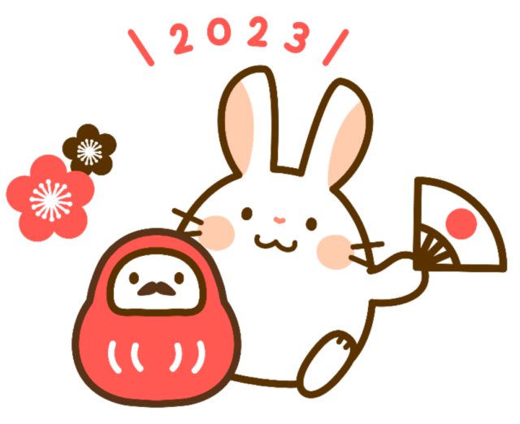

ソフトウェア・セクションの組合員のみなさま、明けまして、おめでとうございます。委員長の仲村です。

昨年中は様々な活動、ありがとうございます。

昨年は、徐々にではありますが新型コロナウィルス蔓延による様々な影響が減ってきた年だったと思います。みなさんの周りではいかがでしょう。ＳＳのメンバーで感染はしたものの、重症化して入院する方などがいなかったのが幸いです。今後も、皆さん引き続き健康にはご留意いただくようにお願いいたします。

ソフトウェア・セクションとCCUでは、一部の方のみとはいえ2023年10月からのインボイス制度導入により少なからず影響を受ける方がいます。電算労では反対の声明を出す予定ですし、CCUではこの制度の勉強会、ソフトウェア・セクションでは影響のある方の個別相談なども予定しています。本当なら、昨年の7月選挙の際に、この是非について大きい争点として議論を闘わせなければならなかったと思っています。もし、みんなが否の意思を示すことができれば、世の中の流れを変えられたかもしれません。

2023年は地方選挙が多く予定されています。私たちの意思で世の中の制度や仕組みを変えることができるということを忘れず、しっかりと示してゆきましょう。

CCUではオンラインでの勉強会・学習会を開催しています。私たちは、スキル向上の努力を続けてゆく必要があります。技術部や組合員が様々な分野の学習会を企画してくださっていますので、ぜひ参加していただき、それをきっかけに新しいものにトライしていってください。

コロナが落ち着いて、以前のようにたくさんのイベントを開催できるようになることを願っています。

ソフトウェア・セクションにとってよりよい年になりますよう、みなさんのご協力をお願いいたします。

■ コンピュータ・ユニオン ソフトウェアセクション機関紙 ACCSESS 2023年1月 No.423 より
