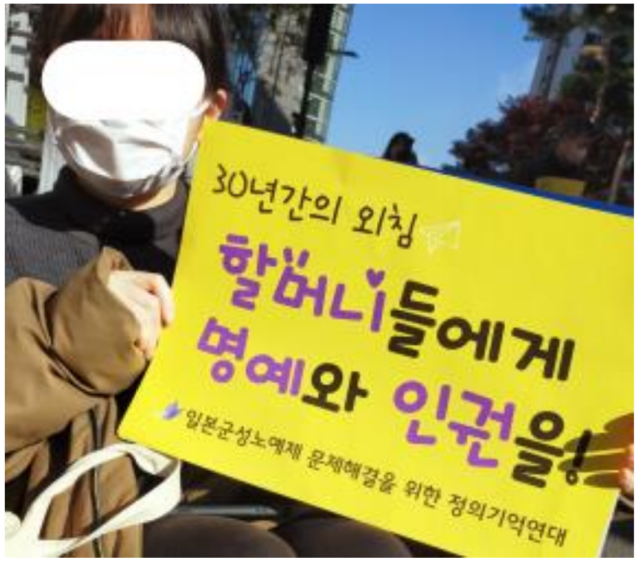

3年ぶりにソウルに行ってきました。コロナ禍以降に変わった出入国手続きと現地の風景を報告します。

■事前準備

１．韓国入国手続き（K-ETA）申請

1. スマホアプリをダウンロード（日本語翻訳に設定）
2. パスポート番号、メールアドレス入力
3. パスポートをアプリ撮影（名前等の入力不要）
4. 入国目的、入国歴有無、滞在先（ホテル等）入力
5. 顔写真撮影
6. 手数料（1,000円程度）クレジット払い
7. 数分後アドレスにOKメールが届く

２．韓国検疫情報事前入力システム（Q-CODE）登録

1. アドレス、パスポート番号、滞在先、入国日等入力
2. 検疫・健康情報 （←今は不要） 入国日はなぜか当日ボタンしか押せないので一時保存

３．日本入国手続き（Visit Japan Web）

1. アカウント登録→アドレス確認・ログイン
2. パスポート番号、住所氏名電話誕生日入国予定 便番号全部手入力

４．検疫手続き事前登録（ファストトラック）

1. パスポート写真撮影
2. 入国者情報全部手入力
3. ワクチン3回接種証明撮影→スマホ画面赤（審査中）
4. 数分後スマホ画面が青（審査完了）

ここまですっごく面倒くさかった！でも全部ちゃんとやっておけば空港で簡単です。

■出入国手続き

１．成田空港チェックインカウンターでK-ETAを提示

２．仁川空港到着時 Q-CODE 画面(入国日修正済)を提示

３．出国時は通常手続き

４．成田入国時ファストトラックの 青画面を提示

■ソウルで 目的だった博物館がNEVER(韓国版Google)のみ完全予約制になってたり、飲食店にタッチパネルのセルフオーダーシステムが普及する一方、観光客相手の大型店が閉店するなどコロナが社会に与えた影響は随所に見られました。ただ若い人は変わらず元気なので、この国は持ち直していくんだろうなと思いました。

■ コンピュータ・ユニオン ソフトウェアセクション機関紙 ACCSESS 2023年1月 No.423 より
