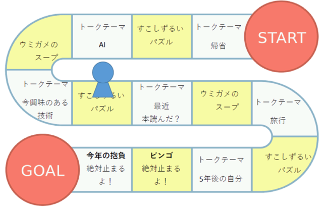
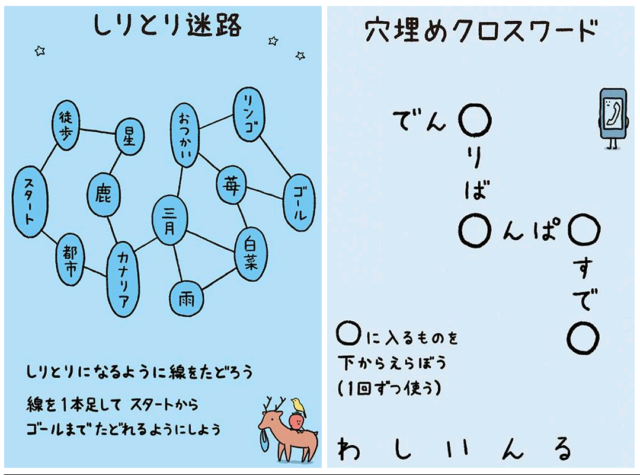

年が明けてから最初にするのは旗開きの準備です。今は対面ではなくオンラインになっているので、比較的準備をしやすいのですが、Zoomというツールを使っているとマンネリになってしまうかなと思います。

参加してくれた人にはできるだけ楽しんでもらえるよう、なにかしらの工夫をしたいなぁと思っていますが、正月明けすぐの旗開きということもあり、今回はスゴロク要素をいれてみました。いやまぁ、自分がフリートークで積極的に話すのが得意じゃないっていうのもあるんですけれども。

スゴロクと相性の良い企画として、指令やモノマネ、罰ゲームなんてのもありますが、芸能人が集まるテレビとは違うので、必ずしも楽しめるとは限らないと思います。そんなわけで、今回は止まったマスに沿ったテーマトークをするようにしてみました。話が詰まったらポンッ、詰まったらポンッとテーマを切り替えながら進めますが、テーマトーク以外にもミニゲームが欲しかったので、今回はウミガメのスープと、すこしずるいパズルというゲームを用意しました。 アルコールが入っても大丈夫な程度にあまり頭を使いすぎず楽しめますが、特にウミガメのスープは1つの問題をみんなでワイワイ言いながら真相を突き止めていくゲームなので、こういうイベントの1コーナーにも向いていると思います。 すこしずるいパズルはアマゾンで1,000円くらいで買えますが一人でじっくり解くこともできるのでこちらもおすすめです。

最後は例年どおり、ビンゴをやって今年の抱負を話しました。 これまで何度かビンゴをやっていますが、ビンゴもオンラインでできますし、商品もアマゾンから直送です。みんなも商品を家まで持ち帰る必要がないので楽ですね。 難点は旗開きが終わって週明けに発送手続きをしようとしたら、値段が若干変わっていることくらいでしょうか。 それぞれの抱負を聞いた後ガンバローで締めて時間通り終了です。

■ コンピュータ・ユニオン ソフトウェアセクション機関紙 ACCSESS 2023年2月 No.424 より
