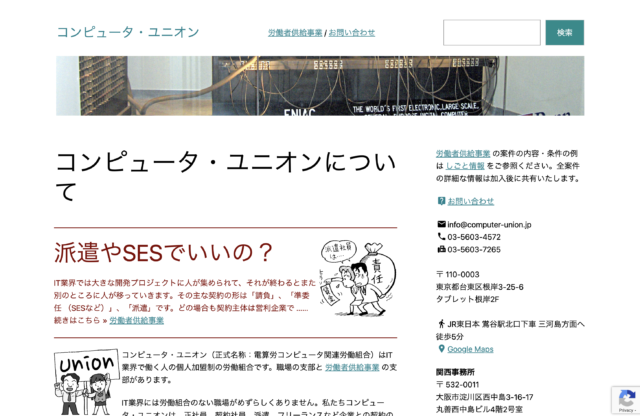

このサイトの WordPress テーマを Twenty Twenty-Three に変更しました。普通のサイトを手間をかけずに作るには十分なものだと思います。



前回このサイトをリニューアルしたときに Twenty Twenty-One が合わないなと感じて [Square](https://computer-union.jp/wp-admin/theme-install.php?theme=square) の無料版を使っていました。しかしながら、無料版ですから当然機能の制約があります。また、無料版でも有料版でもいつか使えなくなりますし、それがいつになるのかはわかりません。

さてどうしたものかとテーマの一覧をながめていると、見覚えのある Twenty Thirteen が目に入りました。「 10年前のものでもまだあるんだ」と感心しつつどのくらい古いものが残っているのか探してみると Twenty Ten が残っています。これは 2008年、つまり 15年前のものです。 WordPress.org 謹製のテーマがそんなに長寿なのであればぜひ使いたいです。

そんなわけ最新の Twenty Twenty-Three を使ってみました。

旧来のテーマとは仕組みが違うのか、子テーマの作り方がよくわからなかったのですが、難しいことは考えずに直接編集すればいいようですね。以下のようなカスタマイズをしています。

- ヘッダの内容はすべて差し替えました。
- デスクトップなど幅の広い環境ではフッタが本文の右に表示されるようにしました。ヘッダ以外を 2:1 のカラムにして、本文とフッタをそこに移動しています。
- リンクの色を変更しました。ヘッダ、本文、フッタの各ブロックに指定しています。もう少しいいやり方がありそうな気がします。
- ブログの各ページに、前の記事と後の記事、それから、カテゴリの目次ページへのリンクを追加しました。カテゴリは 2個しかないのですべて掲示しています。
- [Material Icons](https://fonts.google.com/icons?icon.set=Material+Icons) を使用しています。 [Font Awesome](https://fontawesome.com) に比べてすっきりしたデザインです。地味ですけれど、文字だけに比べるとずいぶん賑やかな雰囲気になります。

Material Icons のために functions.php で以下のようなものを追加しました。

```
<link href="https://fonts.googleapis.com/icon?family=Material+Icons" rel="stylesheet">
<style>
  .material-icons {
    font-size: 1.25em;
    margin-right: 0.1em;
    margin-left: 0.1em;
    vertical-align: text-bottom;
  }
</style>
```
