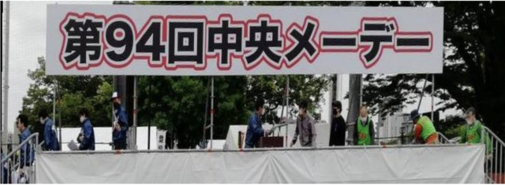
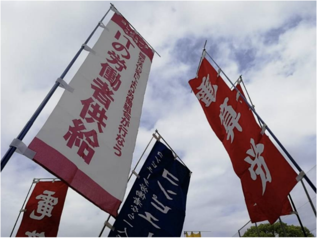

5月 1日、労働者の国際的な祭典であるメーデーが行われました。メーデーで代々木公園に大勢で集まるのは 2019年以来です。平日なので仕事の都合で残念ながら参加できなかった方もいましたが、仕事の都合をつけるなどして電算労からは 9名の参加がありました。

今年は会場の代々木公園サッカー場が人工芝になったため、尖ったヒールの靴などは禁止と聞いていましたが、台車やキャンプ用のイスも使用禁止、旗のポールも地面に立てないようにという指示がありました。元々大きな電算労旗を持っていく予定だったのを直前でやめたのですが、ポールを立ててはいけないそうなのでやっぱりやめてよかったです。人工芝の上では食事は禁止で、アルコールを含めた糖分を含んだ飲み物も禁止で、水分補給のための水などのみ OK でした。しかし人工芝の座り心地は良く、座っても服が汚れないので、個人的にはむしろ人工芝になって良くなった印象です。前方に建てられた舞台も人工芝の上には建てられないということで小さくなっており、看板なども例年とくらべて簡素になっていますがシンプルでいいですね。

さて、今回はメーデーの会場で労働者供給事業の宣伝チラシを配って来ました。  
組織部で計画を進めており、チラシの内容も見直し、労働者供給事業を宣伝するのぼり旗を作成して目立つようにしながら会場の入口付近でチラシを配りました。もともとチラシ配りに参加する予定ではなかったソフトウェア・セクションの組合員も手伝ってくれて合計 94枚のチラシを配りました。

労働組合の関係者が多く集まる場であり、 IT技術者が集まる場ではありませんが、これが巡り巡って家族や知り合いの IT技術者の手元に情報が届いてくれればと思います。代々木公園から恵比寿駅までシュプレヒコールをあげながら歩きました。暑くも寒くもなく、日差しもさほど強くないちょうど良い天気でしたが、そのデモ行進で上げた声が沿道の方に少しでも届いてくれていればと思います。

その後の交流会はイベントとしての企画はしていませんでしたが、参加者全員が交流を深めたいとのことでしたので解散後にそのままお店に入り食事をして親睦を深めました。

■ コンピュータ・ユニオン ソフトウェアセクション機関紙 ACCSESS 2023年6月 No.428 より
