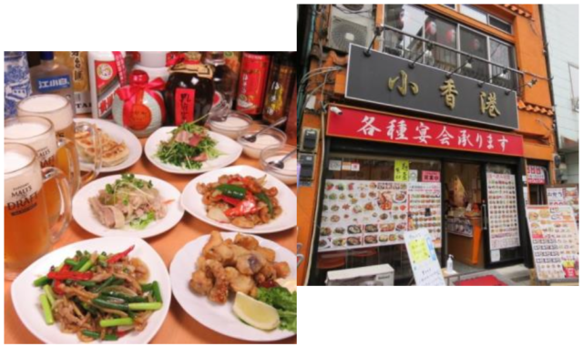
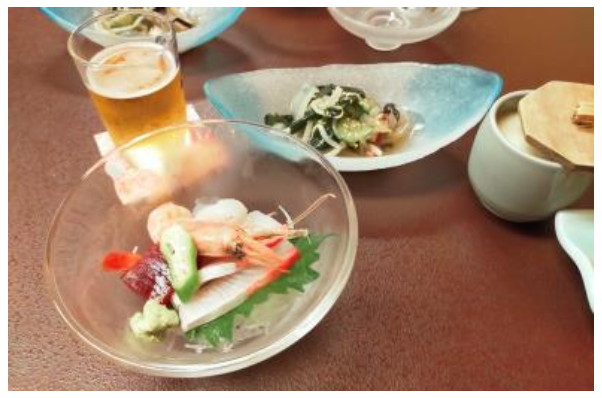

### 第38会定期大会交流会 ≪中華料理小香港≫

前菜、サラダ、海鮮、野菜、肉類炒め料理、揚げ物、点心、チャーハン、スープ、デザートの 12 品入りお得コースと飲み放題のセット。

開店数分前に到着し、薄暗い店内の奥の部屋へご案内。 香港料理と中華料理の違いは分からなかったけれど典型的な町中華のお店でした。餃子もエビマヨのエビも大きくて、脂っぽすぎず味も濃すぎず美味しかったです。

ビールが発泡酒でサワー系も残念だったので紹興酒を頼んだら、ビン１本とグラス１個持ってきたのでビックリ。お料理とお酒で満腹になりました。

### 第30回CCU通常総会交流会 ≪味和居割烹たむら≫

門構えからして敷居が高い雰囲気の割烹料理店。先附、茶碗蒸し、お造り、酢の物、焼魚、煮物、揚げ物に飲み放題のコースです。２階の座敷は法事で使いそうな純和風。涼しげな夏の器が美しいです。

お料理は全体的に小ぶりですが巻き卵や自家製クリームコロッケなど丁寧に調理されていて上品なお味でした。ビールは懐かしいアサヒスーパードライ。麦焼酎と芋焼酎をいただいて、家飲みのように寛げました。

■ コンピュータ・ユニオン ソフトウェアセクション機関紙 ACCSESS 2023年10月 No.432 より
