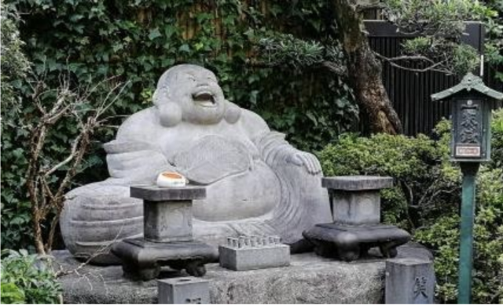

10月14日の土曜日に行われた電算労のイベント、下谷七福神めぐりに参加してきました。

コンピュータユニオン事務所の最寄り駅は鶯谷駅です。普段は駅と事務所と時々居酒屋を往復するだけの道ですが、意外と文化の街でもあります。この付近には七福神を祀った神社やお寺があります。七福神は神様なので神社にいるのかとおもいきや、お寺にいることもあってちょっと不思議です。

今回の七福神めぐりは三ノ輪駅をスタートにして鶯谷駅に向かうルートです。ご家族と参加された方も含めて全部で11名の参加です。

今回、全ての七福神を訪れましたが、私のおすすめは寿永寺の布袋尊です。外に飾られている石像で、雨ざらしになってしまうので少し可哀想ではありますが、他の七福神は小さな建屋の中に飾られているので、覗き込む必要があったりします。それもなんだか失礼な感じがしたので、遠目からでもよく見える石像の布袋尊が好きです。

特に鶯谷駅のホームからも見ることのできる元三島神社には寿老神がいますが、その姿はお正月にしか拝むことはできないそうで、今回は最後に訪れた七福神ですが、残念ながら今回は拝むことができませんでした。七福神めぐりのお勧めの時期はお正月ですね。

文化の街という点では、今回は一葉記念館(樋口一葉)、子規庵(正岡子規)、書道博物館も見学しました。子規庵と書道博物館は駅からも近いので、なにかの機会に一度訪れてみても良いのではないかと思います。

■ コンピュータ・ユニオン ソフトウェアセクション機関紙 ACCSESS 2023年11月 No.433 より
