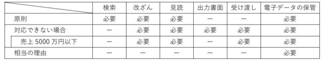

2024年1月から電子帳簿保存法が施行されます。  
もともとは2022年1月から開始するという話だったので すが、当時は急にそんな話が出てきて猛反発があったので2年間の猶予ができて2024年に施行されることになりました。

猛反発があったのは、電子取引の注文書や請求書などをデータのままで保存することが義務化されるという点です。PDFで受け渡しされる注文書も電子取引に含みますし、アマゾンやアスクルで購入する文房具も電子取引です。それら電子取引の書類は、原則として次の対応をする必要があります。

1. 検索機能を確保
2. 改ざん防止
3. 見読(けんどく)可能装置の備え付け

検索機能という点では、日付・取引先・取引金額などで 検索できるように管理する必要があります。  
ルールを決めたファイル名で管理したり、エクセルで管理するなどの対応が求められます。  
改ざん防止という点では、タイムスタンプの利用か、訂正削除の履歴が残るシステムか訂正削除できないシステムの利用か、訂正しないという事務処理規程の作成が求められます。  
見読可能装置というのは、パソコンとモニタがあれば大丈夫です。  
これらはつまり、整理された電子取引の書類を使って税務調査をしやすくするのが目的だと言われています。  
特に大変なのは検索機能の対応です。  
最近は領収書なども郵送されず、ダウンロードする必要のあるものが増えて来ています。それらの全てに検索機能を確保して整理しておく必要があります。大したことない作業にも見えますが量が増えると大変です。

原則として検索機能、改ざん防止、見読可能装置のいずれも対応が必要ですが、検索機能に対応できない場合は税務調査の時に電子取引の書類のデータ受け渡しと、それを整理した出力書面の提出に応じることで救済措置が受けられます。その中で売上高が5000万円以下の事業者は、税務調査の時に電子取引の書類のデータ受け渡しに応じるだけで救済措置が受けられます。  
また、相当の理由(資金面で会計ソフトの導入が難しいなど)があれば、税務調査の時に電子取引の書類のデータ受け渡しと、それを整理した出力書面の提出に応じることで、検索機能、改ざん防止、見読可能装置のいずれにも対応できなくても救済措置が受けられます。  
救済措置もありますが、いずれも対応するのが原則ですね。  
とはいえ、費用や手間を掛けてインボイス制度や電子帳簿保存法に対応しても、ただ納税できるだけなんですよねぇ。

■ コンピュータ・ユニオン ソフトウェアセクション機関紙 ACCSESS 2023年12月 No.434 より
