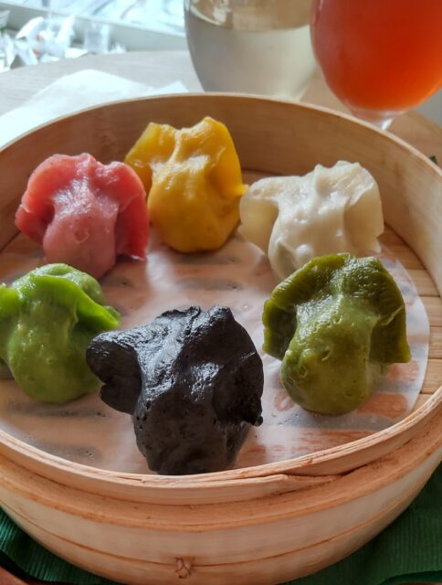
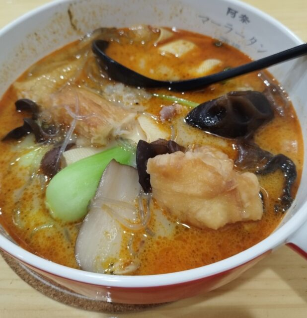

組合の事務所の町内の、居酒屋ではない料理主体のお店を紹介します。なお、根岸3丁目ということは、駅前（1丁目）を含みません。

### VEGAN GYOZA

肉、魚、化学調味料、添加物、ア ルコール、保存料すべて不使用の 餃子がきれいに色分けされて11色揃っています。料理にアルコール不使用ですが、クラフトビールは置いています。餃子にはしっかり味がついているので、知らずに食べたら肉無しとは気がつかないかもしれません。焼いたものより蒸したもののほうがおすすめです。

### 純洋食 グリル ビクトリヤ

「ビクトリア」ではありません。「ビクトリヤ」です。1965年にできた古いお店だそうです。初めての人は、まず、名物ヒレ肉の生姜焼きを。お箸でも切れるやわらかさの、やさしい味です。

### 阿奈マーラータン酒場 鶯谷店

トッピングを自分で選ぶ讃岐うどん方式です。湯条、干豆腐、羊血（羊の血を豆腐のように固めたもの）、キクラゲ。 各種野菜などいろいろ載せられます。どれを選んでも値段 は重量次第です。麺はデフォルトが春雨で、他にも選べるようです。 辛さも選べます。辛いものに慣れていない人は中辛より下のレベルにしておいた方がいいです。

### 台湾料理 小吃 龍一吟 (Ron-Gin)

魯肉飯（ルーローハン）、排骨（パイコー）麺、シジミやエ ビの料理などの台湾料理の定番が揃っています。その中でも肉圓（バーワン）を食べたことない人はぜひお試しを。 お酒に強い人は、紹興酒をロックではなく常温で。

■ コンピュータ・ユニオン ソフトウェアセクション機関紙 ACCSESS 2023年12月 No.434 より
