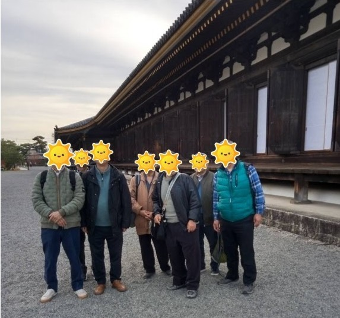
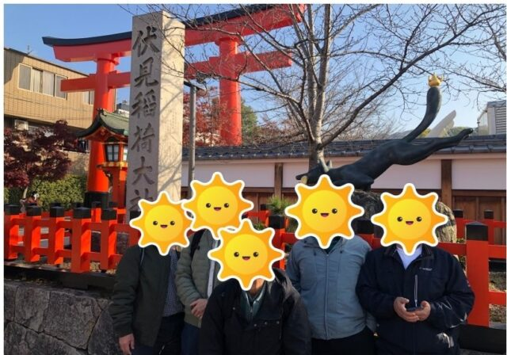
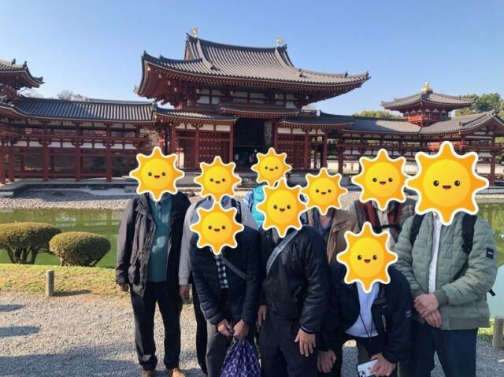

2023年12月9日(土)から1泊2日で大学時代の友人数名 と京都を旅行しました。

　11時に京都駅に集合してから、JR奈良線で東福寺駅に 移動して、駅前の「大黒ラーメン」でお昼を美味しく頂きました。京都在住の同行者がお勧めの人気店だそうです。

　東福寺は紅葉の名所とのことでしたが、ピークは過ぎており一部紅葉が残っている程度でしたが、境内全体は初冬の「清々しさ」があり心地良い雰囲気でした。  
　コロナの5類移行後の旅行で特に気をつけたのが、混雑の回避でしたが、この日の東福寺はゆったりと散策することができました。 東福寺から方広寺へは電車で行きました。

　方広寺では 鐘銘事件の「国家安泰・君臣豊楽の鐘」の前で写真撮影をしました。この鐘銘事件は前週の「どうする家康」で放送されていて、丁度その記念にもなりました。

　方広寺から左に京都国立博物館館を右に見ながら徒歩で三十三間堂に行きました。ここは建物の素晴らしさもさることながら、国宝仏像のオンパレードで期待以上でした。拝観料600円はかなりのお値打ちと思いました。

　翌日は京都駅からJR奈良線で稲荷駅へ移動し、そこから伏見稲荷に行きました。日曜日であることもあってかなり混雑していました。1万本はあると言われている鳥居をくぐって境内の山道を登るのですがで、かなりの急勾配で 「へとへと」になりました。

　その後平等院鳳凰堂を目指して稲荷駅からJR奈良線で宇治駅へ移動しました。ちょっと疲れたので宇治駅前の甘味処「伊藤久右衛門」で「伊藤久右衛門パフェ」をみんなで食しました。学生時代の友達との旅行での「のり」で食べるパフェはなかなか「おつ」なものでした。  
　それから10円玉の平等院鳳凰堂に行きました。建物の中は博物館になっており、とても興味深い資料が展示されていました。外観の美しさもさることながら、中の博物館が充実していました。

　今回は新幹線の切符を初めて「スマートEX」で購入しました。インバウンド復活の情報もあり、新幹線の予約状況を確認している内に購入してしまいました。大変便利なことが分り、ちょっと今風な自分になれたと、一人悦に入っています。

■ コンピュータ・ユニオン ソフトウェアセクション機関紙 ACCSESS 2024年2月 No.436 より
