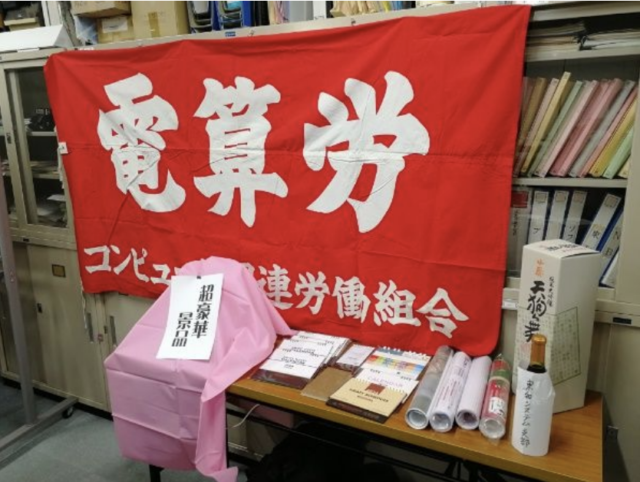
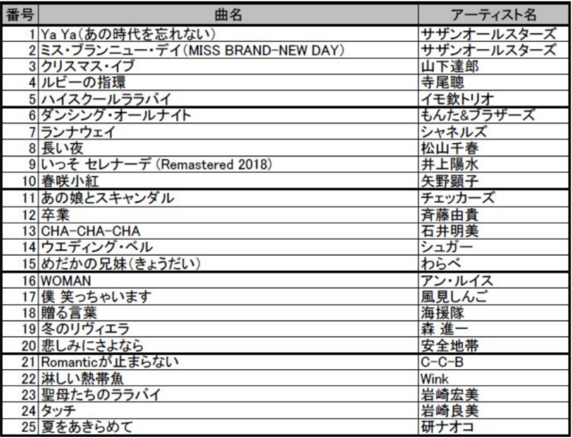

1月5日(金)に電算労の旗開きを行いました。  
　ソフトウェアセクションからは4名の参加がありました。それ以外には、TW 分会からは電算労議長の畠山さんを含む3名、東和システム支部から1名、本部直属から1名の、合計9名でした。  
　以前は事務所の上階にある会議室を使わせてもらっていましたが、貸出しをやめてしまったので事務所で行いました。旗開きをするには手狭になりますが、もう少し参加者がいても対応可能です。とはいえ増えすぎると対応が難しくなる感もあるのでなかなか難しいですね…。

　今回はビンゴを行いましたが、若干手法を変えてみました。1980年代のヒット曲を50曲ピックアップしてリストにし、それに番号をつけてシャッフル再生しました。  
　参加者はイントロを聞いて曲名を当て、正解するとその曲のビンゴ番号がわかります。すぐに分かる曲もあれば、少し聞き進めないとわからない曲などもあり、曲を懐かしんだり当時のエピソードを話したりと楽しい時間を過ごせたかなと思います。  
　今回は商品を1つしか用意しておらず、1人ビンゴしたら終了する予定でした。正解が出てもサビまで再生しましたが、おおよそ1分 30 秒と想定し 25 曲再生が終わった頃には 1 人ビンゴしている想定で、45 分程度を想定していました。し  
かしビンゴが出たあとも参加者から続けてほしいとの要望があり、そのまま続行しおおよそ 1 時間30分ほど行いました。  
　好評だったのでまたやろうと思いますが、著作権の関係でできる機会は限られています。  
　JASRAC によると、(1)非営利の団体が営利を目的とせず (2)参加費等を取らないイベントで (3)演奏者にもギャラを払わない という場合に限って著作権の手続を取らないで音楽を自由に使えます。電算労の旗開きはいずれもクリアしているので問題ありませんが、飲み会などのイベントはみんなから飲食代を受け取るのでアウトであると判断するのが妥当だと思います。 ……となると、やっぱり機会は非常に限られていますね。

　さて、オンラインから参加した人が1名いましたが、ビンゴもふくめてあまりうまく聞き取れなかったようです。雑踏の中でも自分が興味のある話題や自分の名前がよく聞こえるのはカクテルパーティー効果と言われますが、マイク越しですとこれがうまく働かず、特定の話題を聞き分けるのが難しいです。  
　会議なら1つの話題を順番に話すので問題ありませんが、対面で行うイベント事をオンラインからも参加するのは難しいみたいです。

■ コンピュータ・ユニオン ソフトウェアセクション機関紙 ACCSESS 2024年2月 No.436 より
