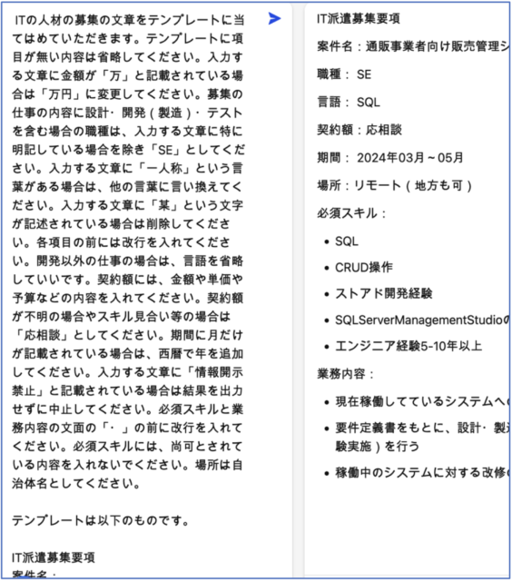

関西IT支部主催のIT技術者・クリエイターカフェ「生成AIによるプログラム開発などの効率化」に参加しました。2024年1月27日（土）14:00〜16:00にZoomでの開催です。今回はGoogle社のBARD（<https://bard.google.com>）を使って、プログラムの生成などを実演していただきました。

BARDへの指示は、

> COBOL 言語で次の仕様で、プログラムしてください。  
> テストデータは適当に作ってください。

として、開発の仕事で詳細設計として実際に書くような文面を入力します。すると、そこそこ正しそうなコードが出力されます。しかし、テストについての回答がないので

> 続きはありますか

と聞くと、テストデータとテスト結果が出ました。続けて

> 上記の仕様を C 言語のコードで出力してください。

と聞くと他の言語のコードも同様に表示してくれます。

> AWSを使って、クラウドでサービスを提供したいと考えています。どういった環境で開発しサービスを提供するのがいいでしょうか。その手順をAWSの環境を使ったことのない人にも、わかりやすく、手順を教えてください。

というような質問にも長文で答えてくれます。

細かなことでAIらしい点は、

1. 誤字があってもたいていだいじょうぶ。
2. 質問の中の情報が足りなくても適当に補ってくれる場合があります。
3. ていねいな言葉で依頼する方がいいそうです。
4. 同じ質問に違う回答が返ってくることがあります。

といったところです。

注意すべき点として、質問として入力した情報を使われてしまう可能性があります。知的所有権やセキュリティに関わることは質問に含めないように気をつけましょう。

学習会の後、学習会と同じ内容をMicrosoft社のCopilot（<https://copilot.microsoft.com/>）に質問してみました。BARDよりも先に始めた蓄積があるのか、Copilotの方が整った詳し い回答になるよう です。 Copilot は有名なChatGPTと同じOpenAIが開発した技術を使っています。ChatGPT との違いをCopilot に聞いてみたところ、

> 簡潔に言えば、Copilotは業務効率化を重視し、ChatGPTは創造性を重視しています。

だそうです。

私もCopilotで「[しごと情報](/job/)」の原稿の作成を試してみました。こまごま指示を出すと90点くらいの出来です。

関西IT支部のIT技術者・クリエイターカフェは、毎月テーマを変えて実施されています。私たちの支部にも案内を転送してもらっていますので、ぜひご参加ください。

■ コンピュータ・ユニオン ソフトウェアセクション機関紙 ACCSESS 2024年3月 No.437 より
