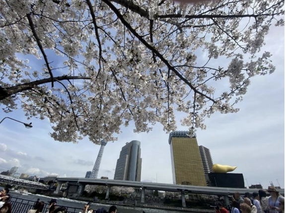
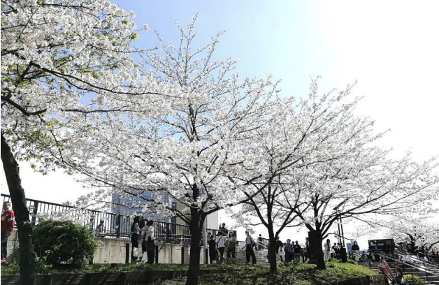

２０２４年４月７日の日曜日、文化部主催のお花見が開催されました。リアルで隅田公園に集まるのは久しぶり。好天に恵まれて満開の桜の元、最高の一日となりました。

当初の予定は一週間前の３月３０日。今年の満開は３月後半と予想されていたけれど雨が続き開花が遅れてしまいました。そのため急遽予定を変更して満開にばっちり合ったのは英断でした。

場所取り班は早朝８：３０から、買い出し班は１０時から総菜やおつまみ、多種多様なお酒を買い揃えてくださり、美味しくいただきました。

文化部の皆さんありがとうございました。

途中で早出の場所取り班が帰ったり、入れ替わりで午後参加勢が到着するなど、自由参加のSSお花見らしい光景が見られたのもよかったです。

支部の外から２名が参加しました。ひとりは公認心理士、ひとりは精神保健福祉士で、東京都のスクールカウンセラー大量雇止めを受けて職能組合を作りたいと考えているとのこと。どちらも職場に同じ専門職がいなくて、仕事上の悩みを相談したり友人を作ることが難しいそうです。

桑波田さんが労働組合の仕組みや労働者供給事業の説明をしたり、みんなが組合に入ったいきさつや組合活動のあれこれ、他の組合の話題など興味深い話がたくさん飛び出しました。初対面の方を交えているとは思えないぐらい話が弾んで楽しかったです。

労働組合に入った経験がない人のなかには、「組合は怖い」「面倒なことをやらされる」といった良くないイメージを持つことも少なくないようです。でも、困ったときに頼るだけでなく、自分の権利を守るために労働組合という形もあるのだということを知る人が増えたらいいなと思いました。

■ コンピュータ・ユニオン ソフトウェアセクション機関紙 ACCSESS 2024年5月 No.439 より
