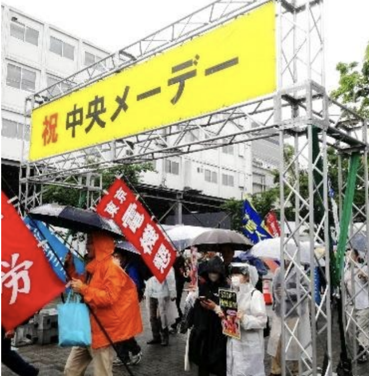
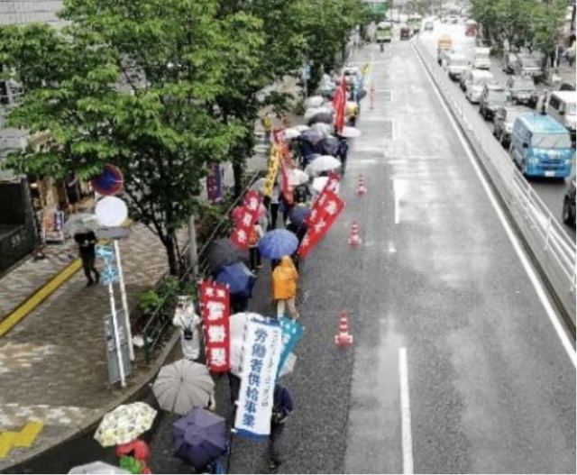
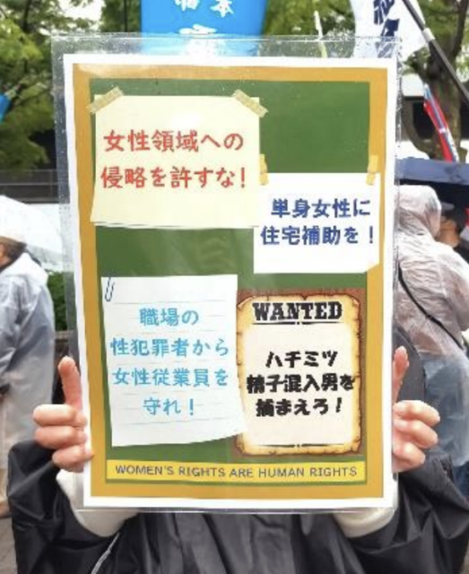

２０２４年５月１日、第９５回中央メーデーが代々木公園にて開催されました。  
平日で雨の予報が出ていたこともあり、電算労からは８名、うちSSからは４名と少なめの参加となりました。

１０時、まだ小雨のうちに開会。主催側から全労連議長の小畑雅子さんが「全ての労働者の賃上げを求め、ストライキも構えて闘い続ける仲間に敬意を表する」とあいさつしました。来賓各氏も次々とあいさつ。４月２７日の連合メーデーと違って岸田首相は来ないので「帰れ」などのヤジも無く平和な感じです。  
男女の賃金格差解消や、時給１５００円以上の最低賃金を求める「メーデー宣言」を採択し、団結ガンバローで集会は終了。この頃雨は本降りに。

電算労のパレードは恵比寿コース。代々木公園から渋谷区役所、宮下公園、渋谷駅を通過して恵比寿駅まで２.５キロ、５０分の道のりです。どしゃ降りの雨の中、電算労の赤い旗と「コンピュータ・ユニオンの労働者供給事業」と書かれた白地に青文字の旗を掲げて、しっかりと行進しました。

労働者供給事業の宣伝チラシは雨で濡れてしまうと受け取ってもらえないので早々に中止しました。  
交流会は恵比寿ビヤホールです。銀座ライオン系のお店で宴会メニューと飲み放題付き。ビールもお料理も最高に美味しかったです。

自作のプラカードをきっかけに職場でおこる犯罪（＊）の話題に。職場環境を安全に保ち社員を守ることも労働組合の役割ではないかと話し合いました。例えばひとりで休日出勤させない、鍵付きロッカーや防犯カメラのような安全設備を会社に要求するなど労働組合にできることはある。めったにないことと軽視せず真剣に考えようと、有意義な議論になりました。

（＊）派遣社員が女性社員の飲み物に精子を混入したり女子トイレに侵入、盗撮を繰り返した性犯罪。２月にSNSで発覚し当該企業と派遣会社はいずれも契約を終了したと発表。犯人は３カ月後の５/１４に器物破損で書類送検された。犯行はSNSで随時レポートされフォロワーが倍増、応援コメントも多数あった。

■ コンピュータ・ユニオン ソフトウェアセクション機関紙 ACCSESS 2024年6月 No.440 より
