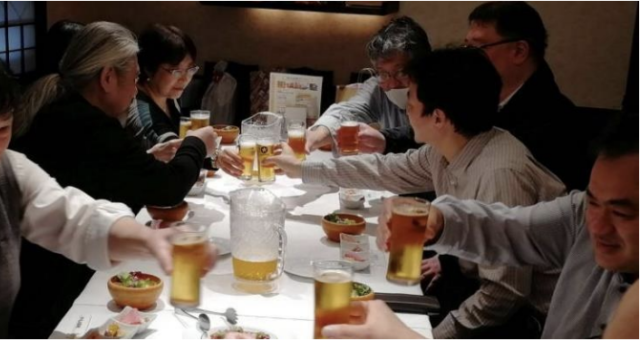

コロナの影響でしばらくの間、実際に対面であって行うリアルイベントは中止していた文化部ですが、昨年の大会後交流会以降、クリスマス会、新年会、花見とネット越しではなく対面で行うリアルイベントを再開しました。

ただ、しばらくの間オンラインイベントばかりをしていた弊害でリアルイベントの企画や運営に困ったことがありました。それは参加者の人数が読めないことです。お店の事前予約時のなどには仮予約であってもあらかじめ確定ではないにしろ、おおまかな参加人数を事前にお店につたえる必要があります。コロナによる自粛前の参加人数などは記録に残っていますが、コロナ自粛後では参加する組合員の面子も変わっており、過去のデータがあまり役にたちません。去年のクリスマス会や今年の新年会ではこのあたりの参加人数の読みに苦労しました。特にクリスマス会はビンゴイベントなどのため、個室を借りる等の必要があります。この個室を借りるのに必要な最低参加人数または、合計の支払金額の最低値（支払額の合計が５万円を超える等）が決まっている店が多いからです。

そこで前回のクリスマス会では事前に部会で書記長にお願いして、皆さんに仮の参加予定を確認してもらい、それに合わせてお店やコースを調整しました。

とはいえ、自粛後から約一年が経ちデータもたまりましたので今後の見積もりは多少楽になるとおもいます。

今後も隅田川の花火大会などリアルイベントの企画をたてていきますので、皆様、事前参加確認のご協力および、参加の程よろしくお願いします。

■ コンピュータ・ユニオン ソフトウェアセクション機関紙 ACCSESS 2024年6月 No.440 より
