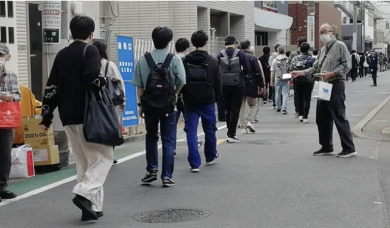

４月２１日に情報処理技術者試験が行われました。それに合わせてリーフレットの配布を行いました。

今回は拓殖大学の文京キャンパスでの配布です。茗荷谷駅から拓殖大学の文京キャンパスへは、向かうルートが１本道なので、参加者が５名でも大変配りやすかったです。

配った枚数は２７０枚です。２７０枚というのは前回実施したリーフレット配布の残りです。コロナ前は５００枚準備して配布をしていましたが、前回はあまり多く配ることが出来ませんでした。そのため今回もあまり多く配れないのではないかと考えて残りを配布したのですが、だいたい４５分ほどで全て配り終えました。こんなことならあらためて５００枚用意しておけばよかったと思いましたが、それはまた次回への糧にしたいと思います。

組合員の加入に最も寄与するのは、職場の人や知り合いへの口コミですが、知ってもらう機会としていろんなアプローチをするのは良いことだと思います。

例えば組織部の活動の一つに案件情報の概要をWebに掲載する活動があります。その案件情報を見て問い合わせをしてきた方もいました。案件情報についてわかる範囲での情報提供をしたあと説明会の案内したところ、残念ながら説明会の申し込みまではされなかったのですが、このような活動がコンピュータ・ユニオンを知ってもらうきっかけになっていることが改めて確認できました。

リーフレット配布も同じように知ってもらうきっかけの一つとして、継続していければと思います。

メーデーの会場でもリーフレットを配ろうと計画していましたが、今年は雨が強かったので断念しました。そういえば情報処理試験のリーフレット配布と雨が重なったことってあまりないかもしれないですねぇ。

■ コンピュータ・ユニオン ソフトウェアセクション機関紙 ACCSESS 2024年6月 No.440 より
