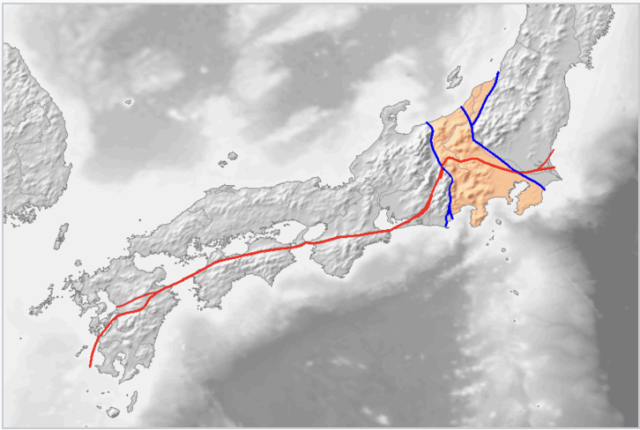
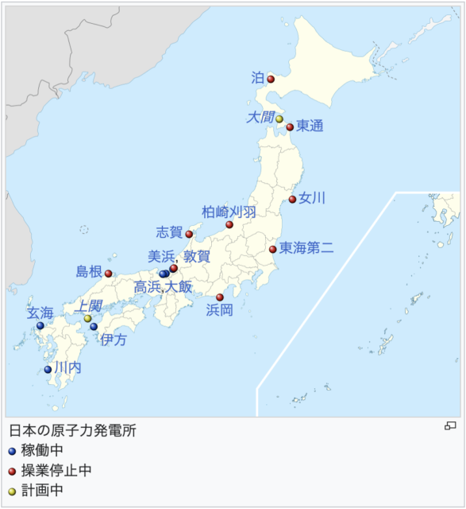

関西電力高浜原発の３号機と４号機の稼働が２０年延長され、６０年の稼働が認可される記事が、５月２９日に配信された。この記事に、某大学教授が、「機器の取替と建屋等の設備、地下基盤などが強固なため、大丈夫。アメリカは８０年まで稼働が認可されているので問題ない」とのコメントを投稿した。猫の額ほどの国土に世界で発生する大地震の２割が集中すると言われる日本で、「大丈夫」などあり得るのだろうか。

偶然だが、土井和己著「原発と日本列島」を読み、地質学視点から原発について書かれていたので興味を魅かれ一読した。要点は下記の通りですが、難しかったので一部だけです。

日本の全景写真を１００年前のそれと比較すると若干変わって見える。川や湖が無くなり、海岸は海側に広まっている。日本列島の中央部に位置するフォッサマグナ（大きな溝）の部分は顕著に変化している。これは、日本の岩盤が軟石で構成され、土壌も柔らかく。地下水が豊富なために海へ流れてしまい、結果、国土が若干ながら広くなるらしい。即ち、日本の土壌は堅牢性に欠け、大地震が発生した場合、建物の倒壊や地面が割れる可能性が高く、原子力発電所など危険物質を扱う建物は適さないということだ。

青線に囲まれたオレンジ色の部分はフォッサマグナ、左側の青線が糸魚川静岡構造線、赤線が中央構造線（Wikipedia 日本語版「フォッサマグナ」より）

１９５０年代、原子力発電所建設の立地条件に「安全性」を定めたが、立地された場所は、交通の便がよい商業的な観点から選ばれてしまった。悲しいことに各種規制その他も基礎となる地質学の観点はどこにも盛り込まれていないとのこと。安全性より経済性が優先されてしまったのである。即ち、日本の土壌は原発には適しておらず、さらに歪められた政策の上に建設されてしまい、現在に至っているとのこと。

著者は最後に以下のように結んでいる。  
「現政権が目論んでいる原子力発電政策は、原子力発電の稼働中およびその後始末において、放射性物質を人の社会から隔離する方策、ことに高レベル放射性廃棄物の処分方策は、数十年後、数百年後には隔離が剥がれて放射性核種の漏洩が発生し、我が国特有の豊富な地下水の動きに乗って海に達する事態になろう。放射性核種による西太平洋の海洋汚染が発生する事態は、現代を生きたものの一人として許される事態ではない。このような事態になり得る政策がなされてならない」。

さて、秋口から電気料金の補助が打ち切られ、物価高に追い打ちをかける。日本の政府と国民は原発にどう向きあうのだろうかと考える今日この頃です。

■ コンピュータ・ユニオン ソフトウェアセクション機関紙 ACCSESS 2024年7月 No.441 より
