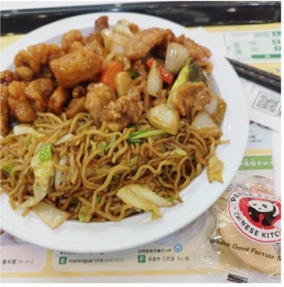
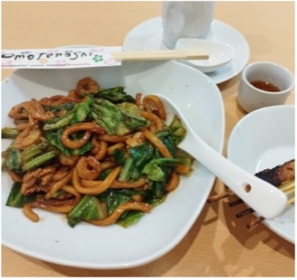
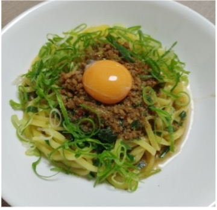
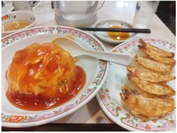

**Panda Express**  
**チャオメン、オレンジチキン、モンゴリアンポーク**

米国では有名なチェーンで、Google Maps には「アメリカ料理」と書いてありました。フォーチュンクッキーも付いています。モンゴリアンポークはどこがどうモンゴルなのかよくわかりません。

**The Kopitiam Hongo**  
**ホッケンミー（福建麺）**

このお店のメニューでは「焼きうどん（マレ式）」です。見た目から想像する辛さはありません。ペナンでは赤、シンガポールでは白の細めの麺だそうです。  
マレーシアには中国系やインド系の人がたくさんいて、中華っぽい料理やインドっぽい料理もあります。

**日清**  
**台湾まぜそば**

自宅の近所に台湾まぜそばのお店はあるのですが、いつも混んでいるのでインスタントで。卵の黄身とネギを追加でトッピングしました。これも十分美味しいです。台湾ラーメンは台湾出身の人による創作料理で、台湾では「名古屋式拉麺」と呼ばれるそうです。

**餃子の王将**  
**天津飯、餃子**

日本の街の中華屋の定番ですね。  
天津出身のCさんにお聞きしたところ、天津に天津飯は無くて、天津甘栗のようなものはあるそうです。  
中国の中でも餃子を食べるのは北の方で、水餃子が一般的です。具は白菜ベースが多いけれど、地方や家庭によって違うそうです。南の方はワンタンです。

■ コンピュータ・ユニオン ソフトウェアセクション機関紙 ACCSESS 2024年7月 No.441 より
