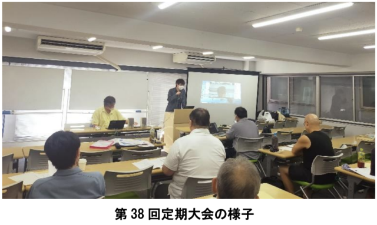

7月20日、拡大支部委員会が行われました。

大会の議案書を作るに先立ってソフトウェアセクションの現状や各専門部の活動の振り返るための会議です。毎年、7月の支部委員会の後に各専門部長を加えて開催しています。

第３９回定期大会議案の下書きを元に、書記長から営業に関する部分と全体の総括と方針および決算と予算を、各専門部長から担当部分の総括と方針を読み合わせしました。支部委員と部長全員で内容を精査し、説明不足や誤記が無いか確認しました。

また、大会当日のタイムスケジュールや司会、記録、議長といった役割決めと、大会までにやるべきことの洗い出しも行いました。

来期の議案では年齢等の理由で就業をやめた後も組合に残るリタイア組合員について新しい提案があり、これから組合員の皆さんで部会で話し合っていただき、その意見を議案に盛り込んでいくことになります。

毎回のことですが役員人事も課題です。組織が硬直化しないためにも役員の交代は適宜必要です。支部委員会も部会と同様にリモート参加可能ですし、会議が月一回増えるだけ。部長は年1回の拡大支部委員会の出席以外は専門部の活動に専念できます。ぜひ積極的に名乗りでて、組合活動の意義とやりがいを実感していただけたらと願っています。

第３９回定期大会はWebからの参加も可能ですが、交流会も企画しているので奮ってご参加ください。

■ コンピュータ・ユニオン ソフトウェアセクション機関紙 ACCSESS 2024年8月 No.442 より
