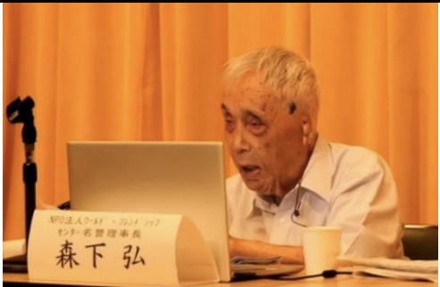
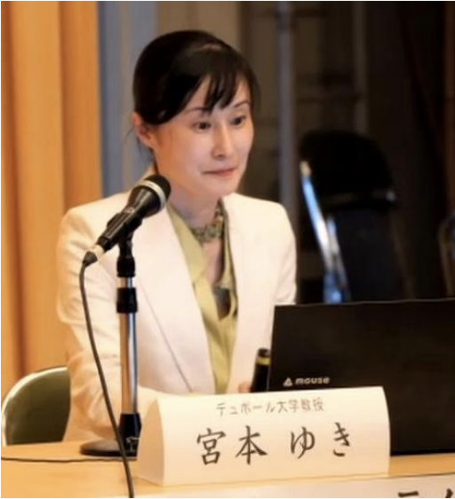

8月5日、日本マスコミ文化情報労組会議(MIC)の広島フォーラムが行われました。1年に1度、原爆の日のタイミングで行われます。現地での参加とWeb配信での参加ができますが、今回はWebからの参加にしました。

通常は大きく2つのコンテンツが用意されており、今年は「少年口伝隊一九四五」の公演と、パネルディスカッションという構成でした。「少年口伝隊一九四五」については、井上ひさし氏が広島の被爆者の姿を描いた朗読劇です。これは著作権の関係で配信されなかったので、Webでは今年はパネルディスカッションの配信のみです。

パネルディスカッションは「日米の原爆観」というテーマで進みました。パネラーは、デュポール大学教授の宮本ゆきさんと、当時被爆をした森下弘(もりしたひろむ)さんです。

森下さんは、トルーマン元大統領と会って話をしたことがあるそうですが、トルーマン元大統領は、「原爆を落とさなかったら、何千万というアメリカの若い兵達が亡くなっただろう。その命を救うことができた」と話をされたそうです。その時を振り返った森下さんは、日本人の小さな子ども達の命が失われる事は考えなかったのだろうかと話します。

宮本さんからは、アメリカの被爆補償法の話がありました。ネバダでの原爆実験が元になって白血病患者が増え、国を相手取った集団訴訟がおきました。その訴訟がきっかけで被爆補償法の成立に繋がりましたが、位置づけとしては「被爆させてごめんなさい」ではなく、「国に貢献してくれたお礼」として補償するものだそうです。

その後、2024年には補償の範囲を広げる法案が提出されました。結果として法案は下院を通らず廃案となったのですが、内容としては、補償する地域を拡大し、核の廃棄物による被害も含む内容でした。これで「国に貢献してくれたお礼」という捉え方から離れることができるという話でした。

この内容が盛り込まれることで捉え方が変わるのは、私にはピンと来なかったのですが、この法案が通っていればなにかが少し変わったのかもしれません。

ディスカッションの最後は、「人と人が出会い、話をすることで友情が生まれ、平和につながる」という森下さんの言葉で締めくくられました。

■ コンピュータ・ユニオン ソフトウェアセクション機関紙 ACCSESS 2024年9月 No.443 より
