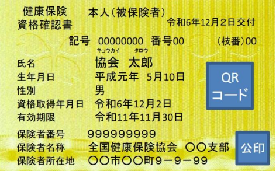

2024年12月2日から、健康保険証の新規発行が終了します。  
それに伴って、マイナンバーカードを健康保険証として使用する「マイナ保険証」に切り替わるのですが、ちょっとこの辺りの話を整理していきましょう。

まず、2024年12月2日に終了するのは健康保険証の新規発行だけです。  
今持っている協会けんぽの青い健康保険証は2025年12月1日まで使用できます。  
国民健康保険証については記載されている有効期限まで使用できます。どちらもそれ以降はマイナ保険証に切り替えることになります。

しかし、マイナンバーカードの保有率はだいたい75％、更に保険証と紐づけているのはその内の80%くらいと言われています。マイナンバーカードを持っていない方や、マイナンバーカードを持っていても保険証と紐づけていない人は、当然マイナ保険証を使えません。

そういった方に対しては、「資格確認書」が交付されます。資格確認書はこれまで使ってきた健康保険証とほぼ同じもので、病院などでは資格確認書を提示すれば大丈夫です。  
資格確認書は12月2日から2025年12月1日にかけて順次交付されていくので、時期はまちまちですがしばらくしたらお手元に届きます。

マイナ保険証を持っていない方は、失業して協会けんぽから国民健康保険に切り替わる場合や、逆に就業して国民健康保険から協会けんぽに変わる時に、資格確認書が必要な旨をつたえてください。  
マイナ保険証を持っておらず通院等で早急に健康保険証が必要な場合には優先して交付手続きがされるそうです。  
必要性が伝わらないと優先して交付されない可能性があります。特に制度が始まった直後はちょっと心配です。

なお、マイナンバーカードと紐づけをした人には資格確認書は届かないのでご注意ください。  
自分がマイナンバーカードと紐づけしたかどうかを覚えていない人は、マイナポータルというスマホアプリで確認できます。

マイナ保険証のメリットについてですが、医療関係の情報共有ができるようになるので、  
おくすり手帳が不要になる他、救急搬送のときに過去の病状の共有ができて搬送先選びがスムーズになります。  
また高額療養費制度の利用が楽になるそうで、従来は一旦自分で支払ってから後ほど払い戻してもらう手続きでしたが、  
これが支払いのときに適用後の金額を支払うだけでよくなります。

ただトラブルもあるそうで、パスワードを何度か間違えるとパスワードの再登録手続きが必要になりますが、  
病院の受付ではパスワードの再登録はできないそうです。今すぐ使いたいんですけどね…。

他には健康保険証の有効期限とマイナンバーカードの有効期限が連動しないので、  
マイナンバーカードの更新を忘れて無効な状態になっていると、その間は健康保険証も使えなくなってしまいます。  
また、紛失した場合の再交付には身分証明書が必要になります。運転免許証やパスポートがない場合、身分証明に大変困ります。  
今後、運転免許証もマイナンバーカードと紐づけができるようになる予定ですが、  
運転免許証も紐づけてしまうと同じ理由で紛失したときに困ります。  
パスポートなど、身分証明に使えるものが無い場合は紐づけないほうが良いかもしれないですね。

■ コンピュータ・ユニオン ソフトウェアセクション機関紙 ACCSESS 2024年12月 No.446 より
