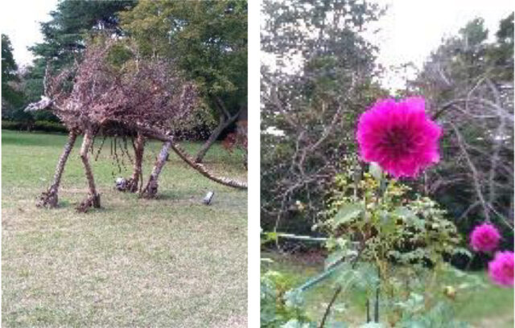

妻が「国立昭和記念公園のコスモスを見に行きたい。」  
と言うので、久しぶりに外出しました。  
１０時半に出発し、最寄り駅に向かいました。目的地は青梅線の西立川駅から徒歩２分。久しぶりに南武線を利用しました。

最近は快速電車があるのですね。川崎・立川間は４３分。電車も一新されており、かつてのイメージはありません。１２時半に西立川駅に到着し、いざ出発。広大な公園が目の前に広がります。シルバー向けチケットで入場。親切な係員が入場をサポートしてくれます。

まずは腹ごしらえです。落ち着いたところで歩き始めると、外国人も結構来園していることがわかりました。  
しばらく歩くと広々とした原っぱがあり、周囲に種々の花が咲いていました。コスモスあったのですが、強風に煽られたせいか根本付近から斜めに曲がっていました。美しいコスモスをイメージしていましたが、残念。（なので、コスモスの写真はありません）

途中、ドラえもんの「どこでもドア」が３つほどあり、上部が丸くくりぬいてあって、写真撮影するようになっていました。それを見ていたら、若い男性から写真を撮ってくれと依頼され、妻が撮って上げました。  
この原っぱを教師に引率された小学生（低学年）の児童の集団がにぎやかに横断していきました。かわいい盛りです。  
少し疲れたので休憩しました。すると、前の道をパークトレイン（牽引車と３両の乗客車）が通過しました。改めて公園の広さを実感しました。そういえばトイレもあちこちにあり、管理が行き届いて清潔感がありました。

こうして２時間余り、散策をしました。空気がきれいで、飼い犬を連れて散歩する人も多くいました。本当に気持ちの良い公園でした。残念だったのは、自衛隊のヘリコプターが頻繁に飛び交っていて、騒々しく感じました。軍事基地のある場所では、騒音被害に悩まされているのだろうと考えると、楽しかった気分も半減してしまいました。基地のない日本を想像しながら帰宅の途につきました。

■ コンピュータ・ユニオン ソフトウェアセクション機関紙 ACCSESS 2025年1月 No.447 より
