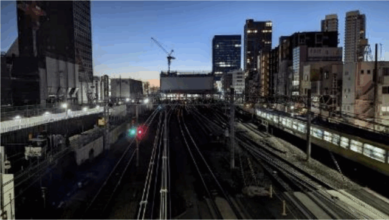
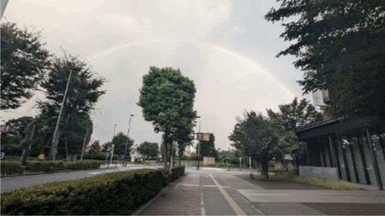

仕事がリモートになり、今まで通勤に使っていた時間分の余裕ができたので…  
運動不足解消に充てることにしました。  
一日一時間と決めて、最初はウォーキングから。距離はだいたい6～7キロで続けること2週間、体重が3キロ減りました。

時間帯は夜明け前。見慣れた風景なのに人がいないのと明るさのせいでいつもと違う場所のように感じます。  
歩いているとだんだん欲が出てくるもので、少しでも体に負担をかけようと坂の多い道を通ってみたり、歩道橋があると渡ってみたり、走ってみたり。走ると言っても200メートルくらいがやっとで、すぐに息が切れてしばらく歩き、またちょっと走っては歩くなんてことを繰り返していたら徐々に走れる距離が伸びてきました。  
ここまでくるとこの状態を維持しなければという義務感のようなものが湧いてきて続けること3か月、体重は8キロ減りました。

そして、いつからか腕立て伏せと腹筋運動もセットでやるようになり、とにかくタンパク質を多めにとるよう心掛けていたらだいぶ がついてきました。もうちょっとで6パックが披露できそうです。（しないけど）  
今では8キロくらい走れるようになり、体重は10キロ減りました。

当面の目標は10キロ走れるようになること。  
運動を始めてから5ヶ月、いつまで続けられるか分からないけど、できる限り現状を維持していきたいなぁ。

■ コンピュータ・ユニオン ソフトウェアセクション機関紙 ACCSESS 2025年1月 No.447 より
