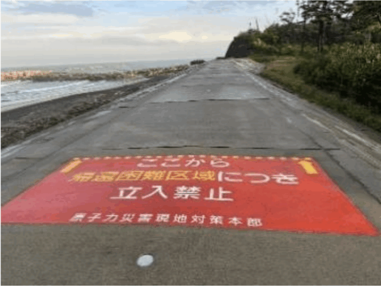
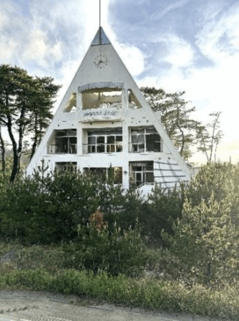

### 1４年めの被災地を歩く

5月中旬、福島原発事故被災地ツアーに参加しました。福島を訪れるのは13年振り、復興の状況はどうなっているでしょうか。

#### 復興はハコモノから

まずは東京電力廃炉資料館。最初に見せられるムービーはひたすら「ごめんなさい反省してます」。見学コースの廃炉ロボットは興味深かったけれど、頑張ってますアピールを感じてしまいます。セキュリティがきつく常に職員に見張られて緊張しました。

県営や町営の施設は広大な何もない地域にバーンと。潤沢な復興予算で多くのハコモノ計画と企業誘致が進行中です。今のところ成功した企業は一社のみで失敗例多数、50億円の復興予算で20人雇用し数年で38億円の損失を出して倒産した企業もあったとガイドさんに聞きました。

ヒロシマ・ナガサキ・ビキニ・福島伝言館は第一原発の計画時から40年間反対運動を続けた僧侶が寺の敷地に自力で建てたもの。反対闘争の歴史を学べます。

浪江町立請戸小学校は海辺の震災遺構。潮風で机などにサビが見られ、経年劣化が心配になりました。

#### 地元生活の復旧はまだらもよう

浪江町津島地区は発災当時、風で北西に流されたプルームの影響で線量が高かったことが住民に知らされず、取り残された地域です。山林が多く除染ができないためほとんど帰還できておらず、商店や病院などの生活インフラが全くありません。住民の方が「復興より復旧を」と強く訴えていたのが心に残りました。

富岡町はスーパーができて新築の家が点々と。新しい双葉駅の周りには整った復興住宅が並ぶけれど誰も歩いていません。宿泊は除染作業員が去った宿泊施設をリニューアルしたホテル。雨が降ると線量が下がる、晴れると上がると話す住民を置き去りに、除染は終わりました。

美しい夕日を背に防潮堤の上を散歩。郡山海水浴場は第二原発に近いため帰還困難区域、立ち入り禁止です。廃墟となった町営海の家の時計は津波の時刻で止まったまま、14年めの福島を見守っているようでした。

■ コンピュータ・ユニオン ソフトウェアセクション機関紙 ACCSESS 2025年6月 No.452 より
