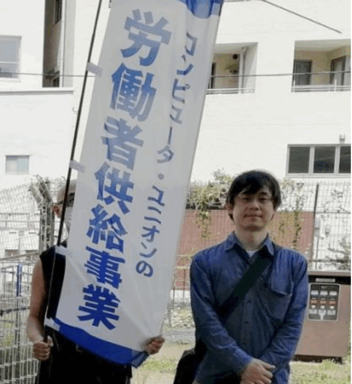

5 月 1 日、メーデーが行われました。  
今年の 5 月 1 日は木曜日で、平日ということもあり、電算労からの参加人数は例年より少ない 5 名でした。  
5 月の初日なので勤務表の対応等もあるのですが、最近は第 1 営業日の午前中に勤務表と請求書を出してくれという取引先もあり、意外とバタバタしているのが実情ですが、早朝に片付けて対応しながら参加しました。  
そのままちょっと早めに会場の代々木公園に向かい、知り合いの組合などに挨拶をしながら旗を持ってリーフレットを配ってきました。

最近では、デモ行進ではなくパレードと呼ぶ事が多くなっていますが、通常はシュプレヒコールを上げながら歩くので、「◯◯をやめろー」というコールをすることが多いですし、デモ行進のイメージといえばそんな印象があると思います。  
しかし、今年は車を出していたのが民放労連だったこともあって、主に音楽を流しながら途中で MC が入る形で説明をするスタイルでした。  
後に、一部を除いて著作権フリーの音楽を流していたと伺いましたが、全体的にラジオを聞いているかのような感覚で聞けたので、沿道を歩く人達にも受け入れやすい構成になっていたのではないかと感じました。

パレードはいくつかの組合で区切って車の後ろをついて歩きますが、今回は民放労連と電算労の2 組合だけで区切られました。  
電算労の参加者が少なかったこともあってか、20 人くらいの塊で歩きました。  
前の塊も後ろの塊も見えないくらい離れていたのですが、交通の流れを大きく妨げないような工夫なのかなと思いますが、参加者の中には分断されているという感想を持った方もいたようです。

デモ行進は代々木公園から恵比寿駅付近まで歩いて、その後交流会を行いました。

■ コンピュータ・ユニオン ソフトウェアセクション機関紙 ACCSESS 2025年6月 No.452 より
