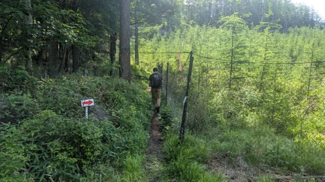
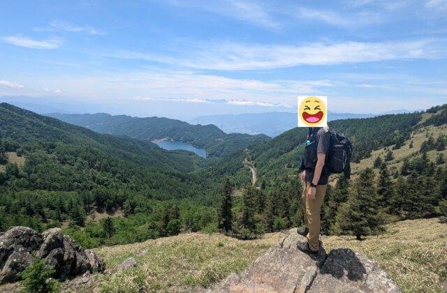
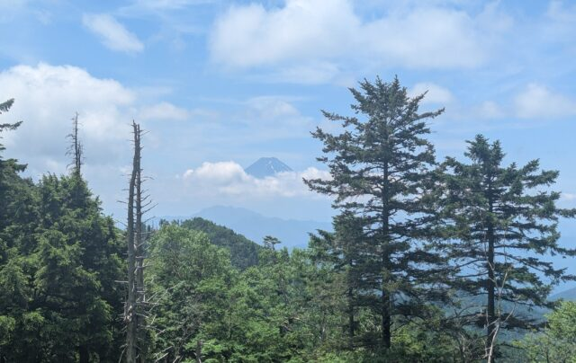

６月の中旬に梅雨の合間を狙って日本百名山のひとつ大菩薩嶺に行ってきました。

　稜線を歩いているときにも親子が物凄い勢いで目の前を横切りなかなか出現率は高めでした。６月とはいえ、日中の気温はもう３０度、、などと心配していましたが、登山口でバスを降りると森の中。ヒンヤリと涼しい空気が心地よく出迎えてくれました。 軽く朝食をとり、いざ出発です。

　最初は茂みの中の細い道を歩いていきます。山登りってこんな感じだったかな？と思いながら進んで行くと徐々に勾配がきつくなり、ちゃんと山でした。

　一山登っては下り、稜線を歩いてまた次の山を登るという感じで所々休憩しながら進んで行きます。

結構と人気のある山らしく、人がたくさんいました。 休憩中にはどこからか鹿が現れ、こちらをじっと眺めていました。大きな目が特徴的で癒されます。

　今回は大菩薩湖を中心にぐるりと歩くコースだったので、富士山や南アルプスなど色々な方角の景色が楽しめました。 途中には壁のような岩山があったり、草原のような開けた場所もあり、ひたすら登り続ける登山よりは気持ちにゆとりをもって歩けたと思います。

　登頂した山は全部で７つ、歩いた距離１２キロ、歩いた時間６時間２０分、ケガすることなく無事に帰ることができました。 この日は、若干雲が多めだったのと富士山には雪がなくなっていたのが少し心残りです。 また違う季節にも行ってみたいと思える山でした。

