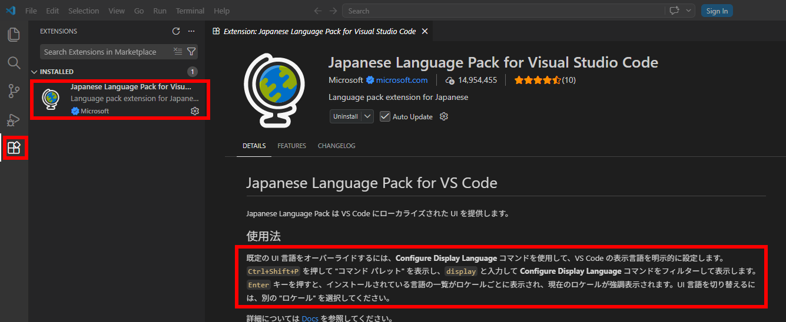

# Windows で VS Code を使う場合

## はじめに

1. 以下、 "VS Code" は "Visual Studio Code" の略です。
  `code` は VS Code を起動するコマンドです。
2. Git に対応した GUI のツールはたくさんありますが、ツールによって操作方法が異なります。
  ここでは `git` コマンドを使う場合だけを記載します。
  GUI のツールについてはそれぞれのマニュアル等を参照してください。
3. VS Code を使うとインデント等の設定や拡張機能の選択が揃うように設定し、リポジトリに保存していますので、
  初心者は VS Code を使ってください。
  VS Code の代わりに Zed などの他のエディタや IDE を利用することもできます。
  - スペルチェッカーの辞書は VS Code 以外の製品にも対応するため `.vscode/settings.json` ではなく
    `cspell.json` を使います。
  - テキストエディタや Markdown 用のエディタを使う場合は、インデントの設定を 2桁のスペースにしてください。

!!!!! 注意 !!!!!

1. Git のユーザー名とメールアドレスを設定せずに `computerunionjp` のリポジトリを更新することを禁止します。
2. SSH の秘密キーはどのようなことがあっても絶対に他人に伝えないでください。

## PowerShell のセキュリティの設定

PowerShell のツールを利用するための環境を準備します。
ターミナルを管理者として実行して PowerShell のコンソールを開き、
PowerShell のセキュリティの設定を RemoteSigned にします。

```PowerShell
PS> Get-ExecutionPolicy
Restricted <-- たぶんこれがデフォルト

PS> Set-ExecutionPolicy RemoteSigned

PS> Get-ExecutionPolicy
RemoteSigned
```

## 製品の導入

### Git と VS Code のインストール

ターミナルを実行して PowerShell のコンソールを開き、
`winget` で Git と VS Code をインストールします。

```PowerShell
PS> winget install --id Microsoft.VisualStudioCode --exact
PS> winget install --id Git.Git -e --source winget
```

ターミナルで新しいタブを開いてインストールの結果を確認します。

```PowerShell
PS> git --version
PS> code --version
```

### Hugo のインストール　(Optional)

Hugo によるローカルでのプレビューを実施したい場合は Hugo をインストールしてください。
これは必須ではありません。

```PowerShell
PS> winget install Hugo.Hugo.Extended
```

ターミナルで新しいタブを開いてインストールの結果を確認します。

```PowerShell
PS> hugo version
```

### GitHub CLI のインストール　(Optional)

GUI よりコンソールでの作業が好きな人は GitHub CLI を使ってください。
これは必須ではありません。

```PowerShell
PS> winget install --id GitHub.cli --exact
```

ターミナルで新しいタブを開いてインストールの結果を確認します。

```PowerShell
PS> gh --version
```

## アカウントとセキュリティ

### Git のユーザー情報

ターミナルを実行してコンソールを開き、
Git のユーザー名とメールアドレスを設定します。
この設定は Git でコミットする際に使われますので、必ず設定してください。
この設定をせずに `computerunionjp` のリポジトリを更新することを禁止します。

```PowerShell
PS C:\Users\username> git config --global user.name "Your Name"
PS C:\Users\username> git config --global user.email "your.email@example.com"
PS C:\Users\username> cat .\.gitconfig
[user]
    name = Your Name
    email = your.email@example.com
```

### GitHub の接続のための SSH 公開キー

`ssh-keygen` で GitHub に登録するキーを生成します。
キーの種類を選択できますが、指定はせず、デフォルトの Ed25519 を使ってください。
デフォルトが RSA の場合は使っているツールが古いかもしれません。
パスフレーズは覚えやすいものでいいので、長い文字列を使ってください。

```PowerShell
PS C:\Users\username> ssh-keygen
Generating public/private ed25519 key pair.
Enter file in which to save the key (C:\Users\username/.ssh/id_ed25519):
Created directory 'C:\\Users\\username/.ssh'.
Enter passphrase (empty for no passphrase):
Enter same passphrase again:
Your identification has been saved in C:\Users\username/.ssh/id_ed25519
Your public key has been saved in C:\Users\username/.ssh/id_ed25519.pub

PS C:\Users\username>  cat .\.ssh\id_ed25519.pub
ssh-ed25519 XXXXXXXXXXXXXXXXXXXXXXXXXXXXXXXXXXXXXXXXXXXX your.email@example.com
```

`.ssh/id_ed25519` は SSH の秘密キーです。秘密キーはどのようなことがあっても絶対に他人に伝えないでください。

`.ssh/id_ed25519.pub` が SSH の公開キーです。これを GitHub に登録します。

- <https://github.com>
  - アカウントの設定
    - Settings
      - SSH and GPG keys
        - New SSH Key

コンソールで `start-ssh-agent` を実行してパスフレーズを入力します。

```PowerShell
PS C:\Users\username> start-ssh-agent
Found ssh-agent at 21976
Found ssh-agent socket at ~/.ssh/agent/s.dGM9bZGNGd.agent.U5OjB1v2mO
Starting ssh-agent:  done
Enter passphrase for /c/Users/username/.ssh/id_ed25519:
Identity added: /c/Users/username/.ssh/id_ed25519 (your.email@example.com)
```

`start-ssh-agent` を利用しない場合、この後の作業で何度も繰り返してパスフレーズを入力することになります。
Git や VS Code はこの `start-ssh-agent` を実行したタブで起動してください。

## ローカルの作業環境の準備

### リポジトリのクローン

ターミナルの `start-ssh-agent` を実行したタブでリポジトリをローカルにクローンして VS Code で開きます。
VS Code でリポジトリをクローンすることもできます。

```PowerShell
PS C:\Users\username> git@github.com:computerunionjp/computerunionjp.github.io.git
PS C:\Users\username> code computerunionjp.github.io
```

### VS Code の拡張機能の導入

VS Code 起動後に推奨する拡張機能 ( Extentions )
のインストールについて聞かれるた場合は素直に従ってください。
`.vicode/extentions` にこのリポジトリの作業のために推奨する拡張機能を設定しているので、
これらの拡張機能を入れることになります。2026年7月19日時点の設定は以下のとおりです。

| ID | 説明 |
| -- | ---- |
| editorconfig.editorconfig             | `.editorconfig` の設定に従って文字コードやインデントのデフォルトを設定する |
| github.vscode-github-actions          | GitHub Actions のステータス表示と操作 |
| bierner.markdown-mermaid              | Markdown のプレビューで Mermaid の作図機能を有効にする |
| davidanson.vscode-markdownlint        | Markdown の文法スペルチェッカー |
| streetsidesoftware.code-spell-checker | スペルチェッカー |
| tomoki1207.pdf                        | PDFのプレビュー |

Markdown については `.vscode/settings.json` に追加の設定をしています。

```JSON
  "markdownlint.config": {
    "MD001": false,  <-- '#', '##' のレベルを厳密に扱わない。
    "MD060": false   <-- 見出しが空のテーブルを許可する。
  }
```

### VS Code の日本語化 (Opitional)

機能拡張 Japanese Language Pack の「使用法」の説明に従って表示言語を設定します。



## 日常の作業

VS Code で `[Ctrl] + [J]` を押すとターミナルが開きます。
そのターミナルで `git` などのコマンドを実行することができます。
Git の操作は VS Code の機能を使うことでもできます。

まず、他の人が更新した内容を取得して、ローカルを最新の状態にします。
これを実行せずに作業を始めて、自分の更新内容が他の人の更新内容と競合すると、とても面倒なことになります。

```PowerShell
PS C:\Users\username\computerunionjp.github.io> git pull
```

記事の雛形を追加します。

```PowerShell
PS C:\Users\username\computerunionjp.github.io> .\tools\create.ps1
記事の種類を選択してください。中止する場合は何も入力せずに Enter を押してください。
  1. しごと情報
  2. ブログ（画像無し）
  3. ブログ（画像有り）
番号を入力してください (1～3): 3
ブログ（画像有り）を選択しました。
content\blog\8101\index.md を作成します。
実行しますか？ [Y/n]:
```

MacOS や Linux ( WSL: Windows Subsystem for Linux を含む ) の場合は
`.\tools\create.ps1 `の代わりに全く同じ機能の
`python tools/create.py` を使ってください。

`[Ctrl]` キーを押しながら上記のパス名 `content\blog\8101\index.md`
をクリックすると、そのファイルを開くことができます。

`content\blog\8101\index.md` に入れる画像は `content\blog\8101\` の下に置いて、
`content\blog\8101\index.md` に `` の形で記載してください。

原稿ができたら GitHub に反映します。
git コマンドの代わりに VS Code の機能を使うこともできます。

```PowerShell
PS C:\Users\username\computerunionjp.github.io> git add .
PS C:\Users\username\computerunionjp.github.io> git commit -m "ブログ記事追加"
PS C:\Users\username\computerunionjp.github.io> git push
```

コミットメッセージには以下の情報を入れないで下さい。それらの情報は Git が自動で記録します。
あなたのミスで間違った情報を記載すると他の人が混乱するので、書かないほうがいいです。

- 日時
- 作成者
- 追加変更したファイル名

作業が終わった後の環境は、常にきれいな状態にしておいてください。

```PowerShell
PS C:\Users\username\computerunionjp.github.io> git status
On branch main
Your branch is up to date with 'origin/main'.

nothing to commit, working tree clean

PS C:\Users\username\computerunionjp.github.io> git pull
Already up to date.
```

## その他

1. PC上のフォルダ名 `computerunionjp.github.io` は変更可です。
  フォルダ名を変えたり移動・コピーしたりしても `.git` サブフォルダがあれば Git は正常に動作します。
2. GitHub アカウントで二要素認証 (2FA) を利用することをお勧めします。
  Google や Microsoft の Authenticator アプリが便利です。
  スマホの故障などに備えて複数の手段を有効にしておくことをお勧めします。
3. SSH の秘密キーやパスフレーズが漏れた可能性がある場合はGitHub の登録を削除し、キーを再生成して登録し直してください。
4. 複数の環境で作業する場合は、それぞれの環境で SSH キーを作成してください。
  一つの環境で作成したキーを安全に他の環境にコピーする手段はありません。
  GitHub には複数の公開キーを登録できます。
