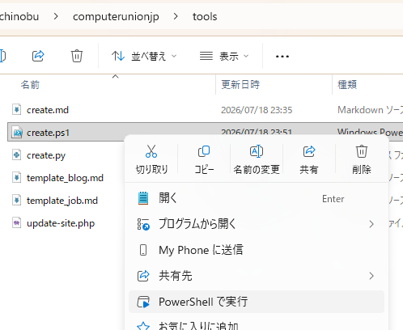

# テンプレート挿入ツールの使い方

> 以下の説明ではディレクトリ（フォルダ）名の区切りに `/` （スラッシュ）を使っています。
> Windows で作業する場合は `\` （バックスラッシュ）または `¥` （半角の￥）に読み替えてください。

新規のページIDを採番して「ブログ」または「しごと情報」の原稿のテンプレートを
`content` の下に作成します。
日付　( 3行目の date: ) は自動で設定します。

Python版 `tools/create.py` と PowerShell版 `tools/create.ps1` があります。

## 1. 必要な環境

以下のいずれかの環境で動作します。

- Python >= 3.9
- Windows PowerShell 5.1
- PowerShell 7+

## 2. 実行方法

### 2.1 Python版

プロジェクトのルートディレクトリで実行してください。

```sh
$ python tools/create.py
記事の種類を選択してください。中止する場合は何も入力せずに Enter を押してください。
  1. しごと情報
  2. ブログ（画像無し）
  3. ブログ（画像有り）
番号を入力してください (1～3): 3
ブログ（画像有り）を選択しました。
content/blog/8083/index.md を作成します。
実行しますか？ [Y/n]: y
```

## 2.2 Windows PowerShell 5.1

```powershell
PS> .\tools\create.ps1
```

または

```cmd
C:\...\computerunionjp> powershell.exe -File .\tools\create.ps1
```

または、エクスプローラ上でマウス右クリックして「PowerShell で実行」を選択。



## 2.3 Windows PowerShell 7

```powershell
PS> .\tools\create.ps1
```

または

```cmd
C:\...\computerunionjp> pwsh .\tools\create.ps1
```
